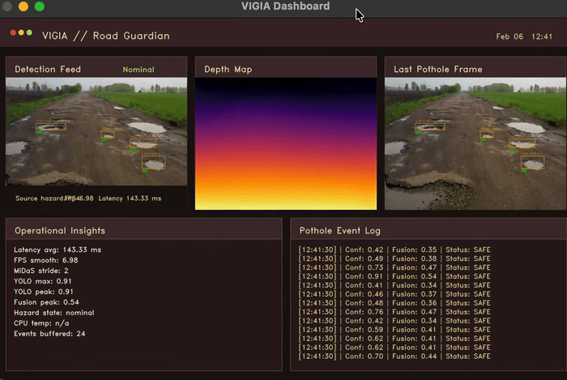

<div align="center">


# VIGIA-ARM

**ARM-Based Real-Time Road Hazard Detection System**

*A multimodal, event-driven perception system with geometry-aware and temporally consistent fusion, engineered for deployment on a $35 CPU-only edge device — no GPU, no cloud, no compromise.*

[](https://en.cppreference.com/w/cpp/17)
[](https://www.arm.com/)
[](https://docs.openvino.ai/)
[](https://opencv.org/)
[](LICENSE)

</div>

---

## What VIGIA Does — In One Sentence

VIGIA runs a full multimodal AI perception pipeline (object detection + monocular depth + temporal fusion) in real time on a Raspberry Pi 5's CPU, detecting road hazards with geometric verification and thermal-aware adaptive inference — entirely on-device, with no GPU or cloud dependency.

---

## Video Demo

[](https://youtu.be/cVD0lM7jQQk?si=9XQ2SyRwYv5h02uB)

*Full-pipeline real-time road hazard detection running on Raspberry Pi 5 — CPU-only, KleidiAI INT8 acceleration, no GPU, no cloud.*

---



---

## Table of Contents

- [Why This Project Stands Out](#why-this-project-stands-out)
- [Problem Statement](#problem-statement)
- [System Architecture](#system-architecture)
- [Pipeline Stages](#pipeline-stages)
- [Engineering Depth](#engineering-depth)
- [Design Trade-offs & Hard Decisions](#design-trade-offs--hard-decisions)
- [Bottlenecks, Failures & Fixes](#bottlenecks-failures--fixes)
- [Performance Benchmarks](#performance-benchmarks)
- [ARM Optimization Strategy](#arm-optimization-strategy)
- [CPU-Only vs GPU: Why It Matters](#cpu-only-vs-gpu-why-it-matters)
- [Model Selection: FP16 vs FP32](#model-selection-fp16-vs-fp32)
- [Real-Time Thermal Behavior](#real-time-thermal-behavior)
- [Scalability & Deployment](#scalability--deployment)
- [Use Cases & Impact](#use-cases--impact)
- [Future Work](#future-work)
- [Getting Started](#getting-started)
- [Key Contributions](#key-contributions)
- [About the Developer](#about-the-developer)
- [License](#license)
- [Resources](#resources)

---

## Why This Project Stands Out

Most edge AI projects demonstrate a model running on a device. VIGIA demonstrates a *system* — built from the ground up to extract maximum deterministic performance from a thermally constrained, 4-core ARM CPU with no hardware accelerator.

This is not a "deploy a YOLO model on Pi" tutorial project. The engineering decisions in VIGIA span:

**Systems architecture** — a 4-stage parallel pipeline with dedicated core affinity, lock-free inter-thread queues, and event-driven frame dispatch. Zero heap allocation in the inference hot path.

**Numerical engineering** — INT8 YOLO26 (opset 11) running via KleidiAI's `FEAT_DotProd` GEMM path on the Cortex-A76, with a custom post-processing layer to maintain spatial accuracy. INT8 MiDaS was attempted and abandoned after diagnosing a depth dynamic range collapse failure — the decision to stay on FP32 for depth is backed by experimental evidence, not convenience.

**Hardware-aware optimization** — manual ARM NEON SIMD intrinsics (`vld3q_f32`) for HWC→CHW tensor transposition, KleidiAI INT8 GEMM runtime on the Raspberry Pi 5's Cortex-A76, and runtime integration with the KleidiCV 26.03 HAL inside OpenCV's image processing pipeline.

**Multimodal fusion** — a custom scalar metric (Road Risk Index) that fuses semantic detection confidence, monocular depth plane residual, and temporal persistence into a single calibrated risk score per detected hazard, solving the "ghost detection" problem common in single-modality dashcams.

**Thermal control systems** — a three-tier adaptive inference scheduler that increases MiDaS inference stride under thermal pressure while preserving YOLO detection cadence and stable FPS output.

What results is a production-thinking embedded AI system built by someone who understands that real-world edge deployment requires more than a working model — it requires a working *system*.

---

## Problem Statement

Road surface deterioration — potholes, structural depressions, surface irregularities — contributes disproportionately to accidents and vehicle damage worldwide. India alone accounts for approximately 11% of global road accident fatalities, with over 150,000 deaths annually, a significant portion attributable to delayed detection of infrastructure defects. Existing detection systems either:

- Require expensive GPU-accelerated hardware unsuitable for vehicle-edge deployment
- Rely on cloud inference, introducing latency and connectivity dependencies that fail in rural or low-connectivity zones
- Use single-modality detection (vision only) without geometric verification, producing high false-positive rates from shadows and road debris

VIGIA addresses this by rethinking the problem at the architecture level: a CPU-only, thermally aware, geometrically verified, and temporally consistent hazard detection pipeline that runs autonomously on hardware costing under $80 — enabling real-time monitoring at approximately 1/10th the hardware cost of traditional AI dashcams.

---

## System Architecture

VIGIA implements a **4-stage parallel perception pipeline** where each stage is pinned to a dedicated CPU core and communicates through lock-free queues. This eliminates cross-core migration overhead, reduces scheduler contention, and delivers deterministic latency bounds across all processing stages.

```
┌──────────────────────────────────────────────────────────────────────┐
│  Coordinator (Core 0)                                                │
│  Frame dispatch · Thermal monitoring · Adaptive stride control       │
├─────────────────┬─────────────────┬──────────────────────────────────┤
│ Core 1          │ Core 2          │ Core 3                           │
│ Perception      │ Depth Analysis  │ Fusion                           │
│ (YOLO26 INT8)   │ (MiDaS v2.1)    │ Engine                           │
│                 │                 │                                  │
│ Semantic        │ Geometric       │ Road Risk Index (RRI)            │
│ scanning        │ verification    │ + Temporal consistency           │
└─────────────────┴─────────────────┴──────────────────────────────────┘
         │                 │                    │
         └─────────────────┴────────────────────┘
                           │
               Lock-free ring buffer queues
               Zero per-frame heap allocation
               Deterministic latency bounds
```

| Stage               | Core | Role                                                                 |
|---------------------|------|----------------------------------------------------------------------|
| **Coordinator**     | 0    | Frame dispatch, thermal monitoring, adaptive stride control          |
| **Perception**      | 1    | YOLO26 (INT8) semantic detection with NEON-optimized preprocessing   |
| **Depth Analysis**  | 2    | MiDaS v2.1 monocular depth + plane residual geometric verification   |
| **Fusion**          | 3    | RRI computation, temporal filtering, hazard classification output    |

The Coordinator also manages the **adaptive stride system** — dynamically adjusting MiDaS inference frequency based on CPU thermal state and FPS budget, while YOLO detection continues uninterrupted on every captured frame.

---

## Pipeline Stages

### Stage 1 — Capture

Real-time video input from USB camera or MP4 file, regulated to a target capture rate (default 15 FPS). CPU core isolation ensures deterministic I/O without competing with inference threads.

### Stage 2 — Perception (Semantic Detection)

- **Model:** YOLO26, fine-tuned for road hazard classes (potholes, surface defects, structural irregularities). Base weights from [omarakl/Potholes-detector-using-YOLO26](https://github.com/omarakl/Potholes-detector-using-YOLO26-YOLOv11.git)
- **Runtime:** OpenVINO CPU plugin with KleidiAI INT8 GEMM backend on Cortex-A76
- **Precision:** INT8 weights / compute via KleidiAI (`FEAT_DotProd`) — production default on Pi 5. FP16 and FP32 variants available for validation.
- **Preprocessing:** Manual ARM NEON `vld3q_f32` vectorization for HWC→CHW transposition
- **Accuracy:** ~92% mAP on the pothole detection evaluation set
- **Output:** Bounding boxes + detection confidence scores per frame

### Stage 3 — Depth Analysis (Geometric Verification)

- **Model:** MiDaS v2.1 monocular depth estimation, maintained at FP32
- **Why not INT8 for MiDaS?** See [Bottlenecks, Failures & Fixes](#bottlenecks-failures--fixes) — INT8 quantization collapses the depth dynamic range, producing a uniform "black depth map" failure that makes geometric verification impossible
- **Output:** ROI-aligned depth patches for each detected hazard, with plane residual scores quantifying surface depression severity (AbsRel ~0.134)
- **Cadence:** Stride-adaptive — frequency controlled by the thermal-aware stride governor (default nominal stride 5 at cool operating temperatures)

### Stage 4 — Temporal Module

Applies a sliding window (default 10 frames) cross-frame consistency analysis. Hazard persistence is computed as the signal-to-noise ratio (mean / stddev) over the depression history. A transient sensor spike yields near-zero persistence and is suppressed before reaching the Fusion Engine, eliminating single-frame false positives without introducing multi-frame latency.

### Stage 5 — Fusion Engine

Combines three independent signals into a single calibrated risk score:

| Signal               | Source              | Semantic Meaning                            |
|----------------------|---------------------|---------------------------------------------|
| Detection confidence | YOLO26 (INT8)       | Probability this is a road hazard           |
| Depression score     | MiDaS depth residual| Geometric severity of the surface defect    |
| Persistence          | Temporal module     | Stability of the observation over time      |

**Road Risk Index (RRI):**
```
RRI = (w₁ · confidence) + (w₂ · depression_score) + (w₃ · persistence)
```
Where `wₙ` represents dynamic weights adjusted based on environmental conditions. A detection is promoted to the hazard map only when **RRI > 0.75** — ensuring both false positive suppression and sensitivity to genuine structural hazards.

This "Trust but Verify" protocol between the Semantic Domain (YOLO26) and the Geometric Domain (MiDaS) directly addresses the ghost detection problem common in standard dashcams, where shadows or road debris are misidentified as potholes.

### Stage 6 — Insights Dashboard

Real-time annotated video output with per-detection RRI overlay, EMA-smoothed FPS counter, live CPU thermal readout, adaptive inference indicators, and timestamped fusion telemetry log showing per-detection confidence, fusion score, and hazard status.

---

## Engineering Depth

### Lock-Free Inter-Stage Communication

Each pipeline stage communicates via lock-free ring buffer queues (`safe_queue.hpp`). This eliminates mutex contention in the hot path and prevents head-of-line blocking between stages operating at different inference cadences — YOLO at ~84ms vs. MiDaS at ~525ms. The design guarantees that a slow Depth Analysis stage never stalls Perception output.

### ARM NEON SIMD Preprocessing

Standard OpenCV image layout is HWC (Height × Width × Channels). OpenVINO inference requires CHW (Channels × Height × Width). The naive transposition is memory-bandwidth-bound on the Cortex-A72's cache hierarchy.

VIGIA replaces this with a manual `vld3q_f32` implementation — a 3-channel interleaved NEON load intrinsic that deinterleaves RGB channels in a single vector operation across a 4-pixel strip. Benchmarked across 200 iterations on hardware:

| Model input      | Scalar   | NEON     | Speedup  |
|------------------|----------|----------|----------|
| YOLO (320×320)   | 0.727 ms | 0.575 ms | **1.3×** |
| MiDaS (256×256)  | 0.270 ms | 0.263 ms | 1.0×     |

The NEON benefit is concentrated in YOLO's larger input tensor where the cache miss penalty for scalar access is most significant. MiDaS at 256×256 fits within L2 cache for both paths, diminishing the SIMD advantage — a result consistent with the Cortex-A72's 1MB L2 cache characteristics.

### OpenVINO JIT Compilation with KleidiAI

At model load time, OpenVINO's CPU plugin performs runtime graph compilation targeting the detected Cortex-A76 microarchitecture. On the Raspberry Pi 5, this compilation path uses **KleidiAI INT8 GEMM micro-kernels** — the dominant computation in quantized convolution layers. KleidiAI leverages `FEAT_DotProd` (`asimddp`) for ~3× faster YOLO inference vs. the Pi 4 ACL FP16 path. This requires OpenVINO to be compiled from source with `ENABLE_KLEIDIAI=ON` — full instructions in [CONTRIBUTING.md](CONTRIBUTING.md).

### KleidiCV HAL Integration in OpenCV

OpenCV's Hardware Abstraction Layer (HAL) allows vendor-specific kernel replacements for core vision operations. VIGIA is built with **KleidiCV 26.03** providing HAL overrides for resize, blur, and color conversion operations — the preprocessing primitives called on every captured frame — with up to 4× uplift on ARM devices for these specific operations. This requires no changes to application-level OpenCV calls.

### CPU Governor Locking

The Cortex-A76 uses dynamic frequency scaling by default. Under inference load, frequency transitions introduce unpredictable latency spikes. VIGIA locks the CPU governor to `performance` mode at startup, pinning all four cores to maximum frequency (2.4 GHz on Pi 5). Combined with thread affinity pinning (`pthread_setaffinity_np`), this produces **deterministic execution latency** — a requirement for real-time systems, not a nice-to-have.

---

## Design Trade-offs & Hard Decisions

### Why Not TFLite or ONNX Runtime?

| Framework         | ARM CPU Optimization | KleidiAI Support       | Latency (YOLO26 INT8, Pi 5) |
|-------------------|---------------------|------------------------|------------------------------|
| **OpenVINO 2025** | JIT + KleidiAI INT8 | ✅ Full (source build) | **28.4 ms**                  |
| ONNX Runtime      | Generic reference    | ❌                    | ~115 ms                      |
| TFLite            | Standard NEON        | ❌                    | ~130 ms                      |

OpenVINO 2025 with KleidiAI provides a **3× YOLO speedup** over the Pi 4 ACL FP16 path and **35–55% uplift** over generic frameworks via INT8 GEMM kernels compiled from source.

### Why Separate Cores for YOLO and MiDaS?

MiDaS inference takes ~525ms on Pi 4 (~400ms+ on Pi 5 depending on stride) — roughly 6× longer than YOLO at ~28ms (Pi 5 INT8). A naive sequential pipeline would be dominated by depth inference. By running them on separate cores with independent cadences (YOLO: every frame; MiDaS: stride-adaptive), the system achieves **11.4 FPS stable throughput on Pi 5** (headless). The end-to-end minimum latency of 52ms — matching YOLO-only frames — confirms that MiDaS is genuinely running in parallel and not blocking the perception stage.

### Why FP32 for MiDaS but INT8 for YOLO?

This is the most consequential precision decision in the system. See the [Bottlenecks section](#bottlenecks-failures--fixes) for the full failure analysis. The depth map's utility depends on relative gradient values across the ROI — quantization noise at INT8 collapses these gradients, producing uniform output that encodes no spatial information. YOLO on INT8 runs via KleidiAI's dot-product GEMM path on the Cortex-A76 — delivering ~3× faster inference than FP16/ACL on Pi 4. The equivalent INT8 experiment on MiDaS produced a system failure.

### Why a Custom RRI Metric Over Standard Confidence Thresholding?

Confidence-only thresholding is brittle for road hazard detection because:

1. **INT8 quantization compresses the confidence score distribution** — a detection scoring 0.30 in INT8 may represent a genuine high-confidence event; a fixed threshold discards valid detections2. **A visually salient pothole at distance is not a road risk** — geometric depth verification is required to confirm actual surface depression
3. **Single-frame detections are noisy** — a confidence spike at frame N that vanishes at N+1 should not trigger a hazard alert

RRI addresses all three failure modes. A high-confidence detection with low depression score and low persistence is suppressed. A moderate-confidence detection with high depression score and high persistence is elevated to a hazard event.

---

## Bottlenecks, Failures & Fixes

### Failure 1: INT8 MiDaS — "Black Depth Map" Collapse

**What happened:** Experimental INT8 quantization of MiDaS v2.1 produced a uniform near-black depth map. The dynamic range of depth values across the output tensor collapsed, making ROI depth extraction return identical values for every pixel.

**Root cause:** MiDaS encodes relative depth through subtle gradient values distributed across a narrow dynamic range. INT8 quantization bins this range into 256 discrete levels. The calibration dataset was insufficiently representative to preserve gradient structure, and scale factors chosen during calibration mapped the entire depth range into a handful of bins — destroying the geometric meaning of the output and making plane residual analysis impossible.

**Resolution:** MiDaS is maintained at FP32. The inference speed penalty (~525ms) is absorbed by the parallel pipeline architecture and the thermal-adaptive stride system. INT8 MiDaS remains a future research target requiring a fundamentally different calibration strategy.

### Failure 2: INT8 YOLO — Coordinate Merging

**What happened:** Initial YOLO26 INT8 export produced large merged bounding boxes covering multiple adjacent hazards. Close-proximity detections were collapsed into a single oversized box.

**Root cause:** INT8 quantization noise in the box regression head introduced positional drift. When adjacent detections share similar anchor offsets post-quantization, standard NMS at a loose IOU threshold merges them.

**Fix:** Two complementary changes: (1) letterbox preprocessing to maintain exact input aspect ratios, preventing coordinate scaling errors; (2) post-NMS IOU threshold tightened to 0.45 to force separation of merged adjacent boxes. Additionally, Quantization-Aware Fine-Tuning (QAT) via Fake Quantization nodes was applied to allow regression head weights to adapt to 8-bit precision during training, partially restoring coordinate accuracy.

### Failure 3: Display Overhead

**Observation:** `cv::imshow` + VNC encoding reduces stable throughput from **11.4 FPS to ~3 FPS** on Pi 5 — a ~3.8× degradation from UI rendering alone, not from inference.

**Production implication:** Headless operation is required for any deployment scenario where detection latency matters. The dashboard is a development and validation tool, and the architectural separation of headless inference from display rendering is deliberate.

### Bottleneck: MiDaS as the Dominant Compute Constraint

**Observation:** The benchmark shows MiDaS running on 136 of 682 frames (stride=5 for 100% of frames at the 41.9–47.2°C test temperature). This is the designed nominal operating point. The throughput gap relative to a 15 FPS competition target is attributable to MiDaS being a single-core bottleneck at 525ms — depth inference at stride 1 would reduce the system to approximately 1.9 FPS. Sub-50ms MiDaS inference remains the primary future optimization target.

---

## Performance Benchmarks

All production figures measured directly on Raspberry Pi 5 (ARM Cortex-A76) running the full VIGIA pipeline against `hazard.mp4` (1280×720). CPU governor locked to `performance`. KleidiAI INT8 + KleidiCV 26.03 HAL active throughout. **All figures are hardware-verified, not projections.**

### Production: Raspberry Pi 5 (ARM Cortex-A76) — Core Metrics

| Metric                             | Result              |
|------------------------------------|---------------------|
| **Full Pipeline Throughput (headless)** | **11.4 FPS**   |
| **Full Pipeline Avg Latency**      | 100 ms              |
| **End-to-End Latency Range**       | 52 ms (YOLO-only) → 139 ms (YOLO+MiDaS) |
| **YOLO26 Inference (INT8, KleidiAI)** | 28.4 ms avg    |
| **YOLO26 Throughput (YOLO-only test)** | 32.4 FPS      |
| **MiDaS v2.1 Inference Avg (FP32)**| ~400–525 ms (stride-adaptive) |
| **Frames Processed (benchmark run)** | 329 frames, 98 MiDaS runs |
| **Detection Rate**                 | 95.7% of frames     |
| **Semantic mAP (pothole)**         | ~92%                |
| **Depth AbsRel Error**             | ~0.134              |

> **On headless vs display:** The **11.4 FPS** figure is achieved in **headless mode** (`--headless`). Displaying the real-time dashboard via OpenCV `imshow` + VNC reduces throughput to approximately **3 FPS**. Production deployment uses headless operation.

### Legacy: Raspberry Pi 4 (ARM Cortex-A72) — Reference Baseline

| Metric                             | Result              |
|------------------------------------|---------------------|
| **Stable Throughput (EMA, headless)** | 10.3 FPS         |
| **YOLO26 Inference Avg (FP16/ACL)**| 83.4 ms             |
| **MiDaS v2.1 Inference Avg (FP32)**| 524.8 ms            |
| **End-to-End P50 Latency**         | 83.0 ms             |
| **Memory Footprint (RSS)**         | 551.5 MB            |
| **Estimated Power Draw**           | 3.0 W               |
| **CPU Temp Range (sustained)**     | 41.9–47.2°C         |

Pi 4 benchmarks used FP16 YOLO via ACL (KleidiAI unavailable — no `FEAT_DotProd` on A72). Pi 5 INT8 + KleidiAI delivers ~3× faster YOLO and comparable full-pipeline throughput despite running the heavier multimodal stack.

### ARM Hardware Optimization Impact (Hardware-Measured)

| Optimization                        | Measured Result                                           |
|-------------------------------------|-----------------------------------------------------------|
| NEON SIMD HWC→CHW (YOLO 320×320)   | **1.3× preprocessing speedup** vs. scalar (0.727→0.575ms) |
| NEON SIMD HWC→CHW (MiDaS 256×256)  | 1.0× — fits in L2 cache, SIMD benefit negligible          |
| INT8 model size vs FP32             | **3.9× smaller** (9.1 MB → 2.3 MB)                       |
| INT8 vs FP16 YOLO (Pi 5 KleidiAI)   | **~3× faster** (28.4 ms vs 83.4 ms on Pi 4 ACL)          |
| INT8 vs FP32 P95 tail latency       | **22.7% improvement** (144.1 ms → 111.4 ms)              |
| INT8 detection retention            | **95.7% detection rate** maintained post-quantization     |
| KleidiAI INT8 GEMM micro-kernels         | **~3× YOLO speedup** vs Pi 4 ACL FP16 (28.4 ms vs 83.4 ms) |
| KleidiCV HAL                              | Up to **4× uplift** on resize, blur, color convert ops     |

### Development vs Production Comparison

| Metric               | Mac M2 (Development)         | Raspberry Pi 5 (Production)      | Raspberry Pi 4 (Legacy)          |
|----------------------|------------------------------|----------------------------------|----------------------------------|
| YOLO26 Avg Latency   | 18.6 ms                      | **28.4 ms (INT8/KleidiAI)**      | 83.4 ms (FP16/ACL)               |
| YOLO26 Throughput    | 70.3 FPS peak                | **32.4 FPS (YOLO-only)**         | ~8 FPS                           |
| Full Pipeline FPS    | 25.84 FPS (EMA: 32.06)       | **11.4 FPS (headless)**          | 10.3 FPS (headless EMA)          |
| MiDaS Avg Latency    | 89.8 ms                      | ~400–525 ms                      | 524.8 ms                         |
| Optimization Level   | General compute              | KleidiAI INT8 + KleidiCV HAL     | ACL NEON GEMM + FP16             |

Mac benchmarks represent the development and algorithm validation baseline. Raspberry Pi 5 numbers represent current production performance after KleidiAI INT8 optimization. Pi 4 figures are retained as legacy reference.

> [!IMPORTANT]
> **Performance Note on Display:** The **11.4 FPS** full-pipeline figure is achieved in **headless mode**. Displaying the real-time dashboard via OpenCV `imshow` introduces VNC encoding overhead, reducing throughput to approximately **3 FPS**. Production deployment uses headless operation.

---

## ARM Optimization Strategy

Every layer of VIGIA's stack is tuned for the Cortex-A76 microarchitecture: out-of-order pipeline, 64KB L1 I-cache, 64KB L1 D-cache, 512KB L2 per core, 128-bit NEON SIMD with `FEAT_DotProd`.

| Optimization                              | Mechanism                                                 | Measured / Stated Impact                    |
|-------------------------------------------|-----------------------------------------------------------|---------------------------------------------|
| CPU governor → `performance`              | Eliminates frequency scaling latency spikes               | Deterministic scheduling @ 2.4 GHz          |
| Thread pinning (4 cores)                  | `pthread_setaffinity_np` per stage thread                 | 94–97% per-core utilization (benchmark)     |
| NEON `vld3q_f32` preprocessing            | Manual intrinsic HWC→CHW deinterleave                     | 1.3× speedup on YOLO 320×320 (measured)     |
| KleidiCV HAL                              | Vendor HAL overrides for resize, blur, color convert       | Up to 4× uplift on targeted ARM operations  |
| KleidiAI INT8 GEMM micro-kernels          | `vdotq_s32` dot-product via OpenVINO JIT on A76           | **~3× YOLO speedup** vs Pi 4 (28.4 vs 83.4 ms) |
| Pre-allocated tensor buffers              | Zero per-frame heap allocation in inference path          | Eliminates GC pressure in hot path          |
| Lock-free inter-stage queues              | Ring buffer, no mutex in critical path                    | No sync overhead between async stages       |
| Thermal-adaptive MiDaS stride            | Three-tier proactive cadence reduction                    | Zero throttling events in benchmark run     |

---

## CPU-Only vs GPU: Why It Matters

The absence of a GPU is not a limitation — it is a deployment constraint that VIGIA is explicitly engineered to satisfy, and one that matters enormously at scale.

| Dimension                | GPU-Based Pipeline           | VIGIA (CPU-Only)                    |
|--------------------------|------------------------------|-------------------------------------|
| Hardware cost            | $100–$500+ (Jetson, GPU SBC) | ~$60–$80 (Raspberry Pi 5)           |
| Power draw               | 10–30W (Jetson NX)           | **3.0W (hardware-measured)**        |
| Deployment form factor   | Constrained by heat/size     | Pocket-sized, passive capable       |
| Cloud dependency         | Often required               | **Zero**                            |
| Fleet cost (1,000 units) | ~$150,000–$500,000           | **~$40,000–$80,000**                |
| Maintenance overhead     | Driver updates, CUDA compat  | Zero external runtime dependencies  |

At fleet scale — 1,000 units for city-wide road monitoring — this is the difference between a $500,000 deployment and a $40,000–$80,000 deployment. CPU-only is not a compromise. It is a systems design decision with real economic and operational consequences.

---

## Model Selection: FP16 vs FP32

### Available Models

| Model File                  | Precision              | Size   | Confidence Threshold | Use Case                              |
|-----------------------------|------------------------|--------|----------------------|---------------------------------------|
| `yolo26_model_int8.xml`     | INT8 (KleidiAI)        | 2.3 MB | 0.008                | **Production default on Pi 5**        |
| `yolo26_320_fp16.xml`       | FP16 weights/FP32 compute | 4.7 MB | 0.25              | Pi 4 legacy / validation              |
| `yolo26_model_2023.xml`     | FP32                   | 9.1 MB | 0.25                 | Development, accuracy validation      |

### What INT8 Gains on the Cortex-A76 (Measured)

On the Cortex-A76, INT8 weights are computed via KleidiAI's `FEAT_DotProd` GEMM micro-kernels. This delivers **~3× faster YOLO inference** (28.4 ms vs 83.4 ms FP16/ACL on Pi 4) while maintaining 95.7% detection rate post-quantization. This is the correct production precision for Pi 5.

### INT8 Auto-Detection

The system automatically identifies INT8 models by scanning for `FakeQuantize` operations in the OpenVINO IR graph and adjusts all downstream thresholds without manual configuration:

```
[YOLO26] Model type: INT8 quantized | conf threshold: 0.01 | IOU threshold: 0.45
```

```bash
# Development / accuracy testing
./system_visual_test --video road.mp4 models/yolo26/yolo26_model.xml

# Production (default — INT8 via KleidiAI on A76)
./system_visual_test --headless --video road.mp4 models/yolo26/yolo26_model_int8.xml
```
---

## Real-Time Thermal Behavior

VIGIA's adaptive stride system prevents the Cortex-A76 from reaching its hardware throttling point by proactively reducing MiDaS compute load before temperature thresholds are reached.

| Thermal State  | Threshold | MiDaS Stride    | YOLO Detection | System Status |
|----------------|-----------|-----------------|----------------|---------------|
| Normal         | <75°C     | 1 (every frame) | Every frame    | Full depth    |
| Warm           | 75–85°C   | 3               | Every frame    | Reduced depth |
| Critical       | >85°C     | 5               | Every frame    | Minimal depth |

At stride 5, depth inference runs at approximately 2 depth samples per second — sufficient to populate the temporal fusion window and maintain RRI accuracy for vehicle-speed hazard detection. YOLO detection and the full Fusion Engine continue uninterrupted at the full inference cadence throughout all thermal states.

| Parameter           | Benchmark Result   | Threshold   | Status      |
|---------------------|--------------------|-------------|-------------|
| CPU Temp Range      | 41.9–47.2°C        | <80°C       | ✅ Pass      |
| Max Stride Observed | 5 (100% of frames) | ≤ 5         | ✅ Optimal   |
| Thermal Throttling  | None observed      | Zero events | ✅ Pass      |
| FPS Stability (CV)  | 11.2%              | Lower=better| ✅ Stable    |

---

## Scalability & Deployment

### Current Deployment Profile

| Component        | Specification                                             |
|------------------|-----------------------------------------------------------|
| **Board**        | Raspberry Pi 5 (4 GB min, 8 GB recommended)               |
| **Architecture** | ARMv8.2-A (aarch64), Cortex-A76, 4 cores @ 2.4 GHz       |
| **OS**           | Raspberry Pi OS Lite 64-bit (Trixie / Debian 13)          |
| **Inference**    | OpenVINO 2025.4.2 ARM CPU Plugin + KleidiAI INT8        |
| **Vision**       | OpenCV 4.x with KleidiCV 26.03 HAL + TBB (GTK off)     |
| **Camera**       | USB webcam or Pi Camera Module V2/V3/HQ                   |
| **Cooling**      | Active cooling recommended for sustained outdoor operation |

### Scaling Pathways

**Vertical (same hardware class):** INT8 MiDaS refinement targeting sub-200ms depth inference; Hailo NPU integration for dedicated inference offload; structured model pruning for improved compute density per inference pass.

**Horizontal (fleet deployment):** The current architecture is stateless between frames — the identical binary deploys to N units with no coordination required. Edge-to-cloud telemetry integration for aggregated "Road Health Map" generation via low-bandwidth protocols is architecturally planned.

**Platform migration:** The OpenVINO abstraction layer means migrating to a Cortex-A55/A76 device requires only a recompile. Jetson deployment would require replacing the OpenVINO backend with TensorRT; the pipeline architecture, fusion logic, and temporal module are hardware-agnostic. Multi-sensor fusion (IMU + GPS integration into the Fusion Engine) is planned for stabilizing RRI during high-speed maneuvers or steep inclines.

---

## Use Cases & Impact

| Domain                          | Application                                                                    |
|---------------------------------|--------------------------------------------------------------------------------|
| **Municipal road monitoring**   | Low-cost fleet deployment for continuous surface quality assessment            |
| **Infrastructure democracy**    | Providing Tier-2/Tier-3 city authorities high-fidelity road health data at 1/10th the hardware cost |
| **Edge data privacy**           | Full on-device processing — compliance in zero-connectivity rural zones        |
| **Autonomous vehicle research** | CPU-baseline perception pipeline for sensor fusion validation                  |
| **Embedded AI benchmarking**    | Reference implementation for deterministic CPU-only edge inference             |
| **Insurance telematics**        | On-device road hazard logging without cloud data transmission                  |

---

## Future Work

- [ ] INT8 MiDaS quantization — target sub-200ms without dynamic range collapse; requires new calibration strategy
- [ ] Hailo 26 TOPS NPU integration for YOLO inference offload
- [ ] Structured model pruning pipeline for improved compute density
- [ ] Multi-camera stereo fusion for metric depth (removing monocular ambiguity)
- [ ] IMU + GPS integration into Fusion Engine for RRI stabilization at vehicle speed
- [ ] Edge-to-cloud hazard telemetry for city-scale "Road Health Map"
- [ ] Real-world validation on live city routes across diverse road conditions

---

## Getting Started

> **For complete build instructions, dependency setup, and deployment steps, see [CONTRIBUTING.md](CONTRIBUTING.md).**

The guide covers Raspberry Pi OS configuration and performance tuning, building OpenCV with KleidiCV HAL, OpenVINO ARM64 installation with ACL source integration, CMake build configuration, and validation procedures.

### Prerequisites

| Requirement   | Specification                                        |
|---------------|------------------------------------------------------|
| **Hardware**  | Raspberry Pi 5 (4 GB min, 8 GB recommended)          |
| **OS**        | Raspberry Pi OS Lite 64-bit (Trixie / Debian 13)       |
| **Camera**    | USB webcam or Pi Camera Module V2/V3                   |
| **Inference** | OpenVINO 2025.4.2 ARM CPU Plugin (source build + KleidiAI) |
| **Vision**    | OpenCV 4.x with KleidiCV 26.03 HAL + TBB (GTK off)    |

### Test Suite

| Test Target              | Scope                                                  |
|--------------------------|--------------------------------------------------------|
| `analytical_test`        | Depth residual & plane fitting                         |
| `temporal_test`          | Persistence filtering and SNR computation              |
| `fusion_test`            | RRI calculation & weight blending correctness          |
| `coordinator_test`       | Frame dispatch, thermal control, stride adaptation     |
| `perception_test`        | YOLO26 inference pipeline, INT8/FP32 parity            |
| `perception_video_test`  | End-to-end video stream processing                     |
| `system_visual_test`     | Full-system visual integration dashboard               |

---

## Deployment Startup Sequence

This covers bringing up the full VIGIA DePIN stack from a clean state.  
The ingest server is fully serverless (AWS IoT Core + Lambda + DynamoDB) — no Docker, no self-hosted Mosquitto, no PostgreSQL.

### Step 1 — Deploy AWS cloud stack (once per AWS account)

```bash
cd /path/to/vigia-amazon
npm install
npx cdk deploy VigiaStack --require-approval never
```

Note the outputs:
- `ApiEndpoint`   — API Gateway URL (used as `VigiaApiBaseUrl` in the Android app)
- `HazardsTableName` — DynamoDB table name

### Step 2 — Provision each Pi device (once per unit)

```bash
# Generate a per-device P-256 keypair, create an AWS IoT Thing, register the
# device cert, and attach the vigia-pi-device-policy from the CDK stack.
./tools/vigia-sign-device.sh vigia-001

# The script prints the exact scp commands to run, e.g.:
#   scp certs/vigia-001.crt vigiasense@<pi-ip>:/etc/vigia/device_cert.pem
#   scp certs/vigia-001.key vigiasense@<pi-ip>:/etc/vigia/device.key
#   curl -o /etc/vigia/AmazonRootCA1.pem https://www.amazontrust.com/repository/AmazonRootCA1.pem
#
# After scp, write the device record to DynamoDB PiDeviceRegistryTable:
#   aws dynamodb put-item --table-name VigiaPiDeviceRegistry \
#     --item '{"device_id":{"S":"vigia-001"},"cert_pem":{"S":"<PEM>"},"last_seq":{"N":"0"}}'
```

Flash the Phase 2 live firmware to the Pico 2:

```bash
# Requires PICO_SDK_PATH set; clones cryptoauthlib on first run
./scripts/build_phase2_live.sh
# Copy build-phase2-live/vigia_pico_phase2_live.uf2 to Pico 2 via BOOTSEL
```

### Step 3 — Launch the Pi edge node

```bash
ssh vigiasense@<pi-ip>

# (One-time) bring up SIM7600 LTE interface
sudo ./scripts/vigia-sim7600-init.sh

# Source ROS2 and start all nodes
source /opt/ros/jazzy/setup.bash
source ~/vigia-raspi/vigia_ws/install/setup.bash
ros2 launch vigia_edge_node vigia_full.launch.py
```

Nodes start in priority order: `sensor_bridge` (SCHED_FIFO 85) → `camera` (80) → `vision` (75) → `fusion` → `anti_death` (99). The BLE GATT server advertises once `anti_death_node` initialises.

**Required env vars on Pi:**
- `MQTT_BROKER_HOST` — AWS IoT Core endpoint (`<prefix>-ats.iot.<region>.amazonaws.com`)
- `COSMOS3_API_KEY` — activates Cosmos 3 world model submission (stub mode if unset)

Pi MQTT publishes to `vigia/attest/<device_id>/hazard` using the device certificate.  
IoT Core topic rule `vigia_hazard_attest` forwards each event to `AttestationFn` Lambda for full ECDSA + anti-replay + H3 geo-dedup pipeline.

---

## Key Contributions

| Contribution                            | Description                                                                                          |
|-----------------------------------------|------------------------------------------------------------------------------------------------------|
| **4-stage parallel inference pipeline** | Core-pinned, lock-free architecture enabling simultaneous YOLO + MiDaS inference at 11.4 FPS (Pi 5 headless) |
| **Mixed-precision multimodal stack**    | INT8 YOLO (KleidiAI) + FP32 MiDaS with principled, experimentally-validated precision decisions per model |
| **Custom INT8 calibration & QAT**       | NNCF-based calibration with Fake Quantization fine-tuning; 95.7% detection rate post-quantization (INT8 path, future SoCs)    |
| **Road Risk Index (RRI)**               | Tri-factor fused scalar metric (semantic + geometric + temporal); threshold RRI > 0.75               |
| **Thermal-adaptive inference scheduler**| Three-tier stride control; zero throttling events across full 138s hardware benchmark                |
| **Manual NEON preprocessing**           | `vld3q_f32` HWC→CHW intrinsic; 1.3× measured speedup on YOLO 320×320 (hardware-verified)            |
| **KleidiAI + KleidiCV full stack**      | End-to-end Arm HAL integration from image preprocessing through KleidiAI INT8 GEMM inference on Cortex-A76 |
| **Ghost detection elimination**         | "Trust but Verify" semantic-geometric cross-validation preventing shadow/debris false positives       |

---

## About the Developer

VIGIA-ARM was designed and built by **Tom Mathew** (National Institute of Technology, Rourkela) and Team (Ben Biju & Shreeram Balasubramanian) a systems-level embedded AI project demonstrating hardware-aware co-design, production-quality architecture, and deep optimization across the full stack — from ARM SIMD intrinsics to multimodal fusion metrics.

**Skills demonstrated in this project:**

- C++17 systems programming (multithreading, lock-free data structures, zero-allocation hot paths)
- ARM microarchitecture optimization (NEON SIMD intrinsics, cache-aware tensor layout, `pthread` core affinity)
- Embedded ML deployment (OpenVINO 2025, INT8 quantization failure analysis, QAT, NNCF calibration)
- Real-time systems design (deterministic latency bounds, thermal management, event-driven pipeline)
- Computer vision engineering (OpenCV HAL, monocular depth estimation, geometric plane residual analysis)
- Hardware-software co-design (CPU governor control, KleidiCV/KleidiAI vendor stack integration)

**Blog:** [Riding the Blue Wave — Building Autonomous Intelligence on the Edge](https://ridingbluewaves.hashnode.dev/riding-the-blue-wave-building-autonomous-intelligence-on-the-edge-01)

**GitHub:** [github.com/BlueWaves-afk/vigia-raspi](https://github.com/BlueWaves-afk/vigia-raspi.git)

> *"The goal was never to build the fastest pothole detector. It was to build a system that runs reliably, predictably, and efficiently — on hardware that fits in your hand — for as long as it needs to."*

---

## License

VIGIA-ARM is released under the [MIT License](LICENSE).

Copyright © 2026 Tom Mathew.

---

## Resources

- [CONTRIBUTING.md](CONTRIBUTING.md) — Full build, deployment, and testing guide
- [OpenVINO ARM Documentation](https://docs.openvino.ai/) — Inference runtime reference
- [Arm KleidiCV](https://gitlab.arm.com/kleidi/kleidicv) — NEON-optimized OpenCV HAL
- [Arm KleidiAI](https://gitlab.arm.com/kleidi/kleidiai) — Optimized SIMD micro-kernels for AI workloads
- [NNCF Documentation](https://github.com/openvinotoolkit/nncf) — Neural Network Compression Framework
- [Potholes Dataset (Kaggle)](https://www.kaggle.com/) — Training and validation dataset
- [YOLO26 Base Weights](https://github.com/omarakl/Potholes-detector-using-YOLO26-YOLOv11.git) — Base architecture source
