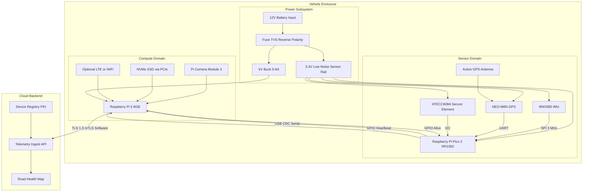
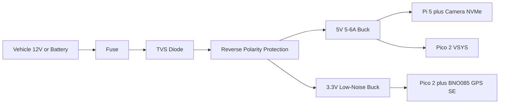
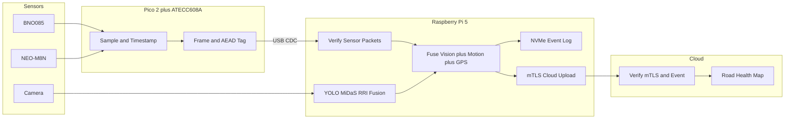
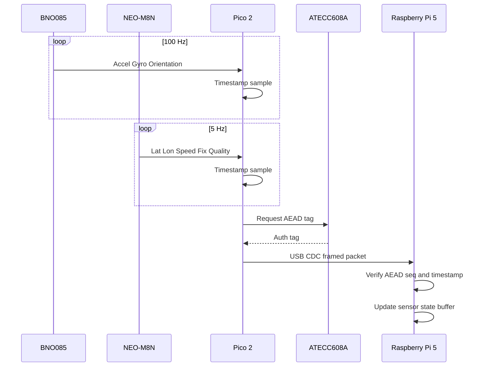
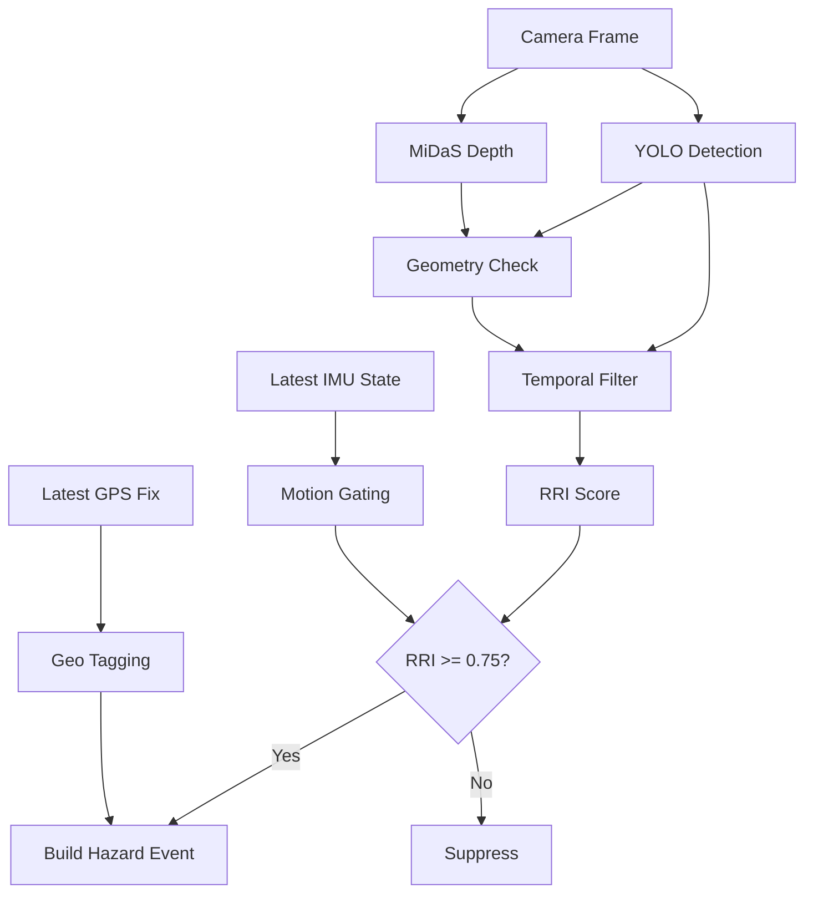
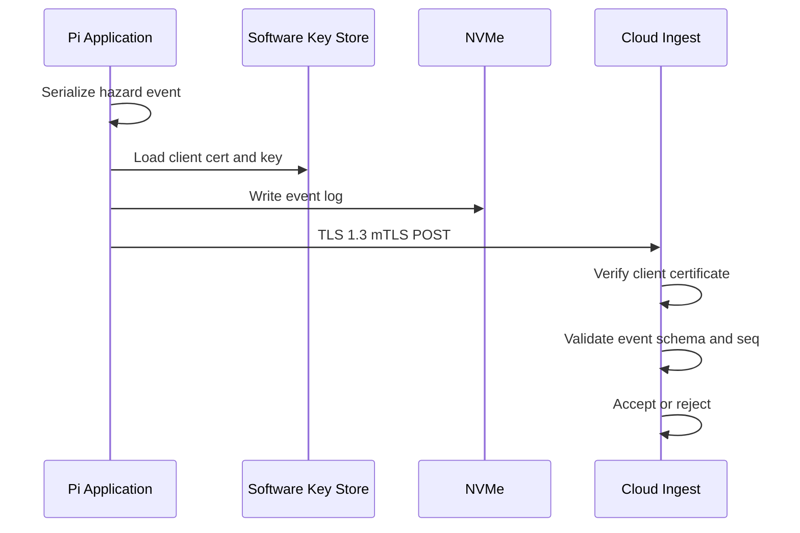
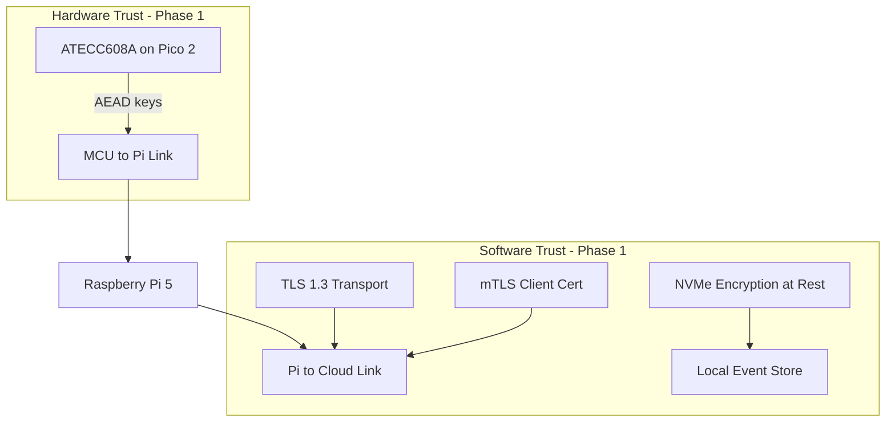
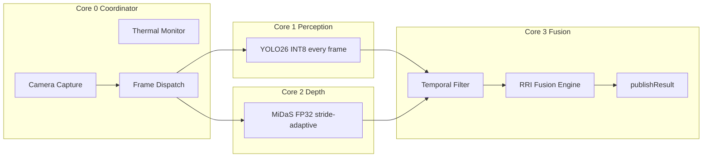

# Hardware Architecture

Team reference for the edge device hardware topology, component roles, data flows, security boundaries, and phased rollout.

**Target:** Raspberry Pi 5 edge computer + Raspberry Pi Pico 2 sensor hub + BNO085 IMU + NEO-M8N GPS + ATECC608A secure element (MCU side only, Phase 1).

---

## System Block Diagram



---

## Compute Split

| Concern | Raspberry Pi 5 | Raspberry Pi Pico 2 |
|---|---|---|
| Primary job | Vision AI, fusion, storage, networking | Real-time sensor sampling |
| Timing | Non-deterministic (Linux scheduler) | Deterministic (bare-metal Pico SDK) |
| IMU rate | Cannot guarantee 100 Hz under inference load | Guaranteed 100 Hz BNO085 reads |
| GPS | Competes with other USB devices if attached directly | UART to Pico 2, shared timestamp domain |
| Accident detection (future) | Post-process clips, upload events | Detect impact spikes in microseconds |
| Watchdog | Can stall during heavy inference | Independent heartbeat to Pi |
| Firmware update | OS packages, containers | UF2 drag-and-drop or `picotool` over USB |

**Power rule:** The Pi is a load, not the system power supply. Protected input feeds separate 5 V (Pi) and 3.3 V (sensor) rails.

---

## Component Reference

### Raspberry Pi 5

| Attribute | Detail |
|---|---|
| Role | Camera capture, YOLO + MiDaS inference, RRI fusion, local logging, cloud uplink |
| Software | C++17, OpenVINO 2025, OpenCV 4.x, KleidiAI INT8 |
| Storage | NVMe SSD via PCIe (preferred over SD-only for field logging) |
| Cooling | Active cooler required under sustained inference |
| Camera | Pi Camera Module 3 (CSI preferred) or secured USB camera |
| Telemetry hook | `Coordinator::publishResult()` in `src/coordinator.cpp` |

### Raspberry Pi Pico 2 (RP2350)

| Attribute | Detail |
|---|---|
| Part | RP2350 — dual Cortex-M33 @ 150 MHz, 520 KiB SRAM, 4 MiB flash |
| Role | BNO085 + GPS sampling, timestamping, packet framing, watchdog |
| Link to Pi | USB CDC — appears as `/dev/ttyACM0` |
| Debug | BOOTSEL + UF2 (primary); optional SWD on debug header |
| Firmware | Separate repo or `firmware/` subdirectory; built with Pico SDK |
| SDK | Pico SDK 2.x — TinyUSB CDC, hardware SPI/UART/I2C, DMA |

**Why Pico 2 over a generic MCU dev board:** Same vendor ecosystem as Pi 5, dramatically faster bring-up (no CubeMX), sufficient compute for 100 Hz IMU + GPS + ATECC608A signing, and native USB device support without middleware stacks.

### BNO085 IMU

| Attribute | Detail |
|---|---|
| Role | Linear acceleration, angular velocity, orientation, gravity vector, vibration/impact evidence |
| Bus | SPI0 to Pico 2 at 3 MHz (not Pi) — SHTP protocol, DMA-driven |
| Sample rate | ~100 Hz |
| Mounting | Rigid mount on vehicle frame; mark axis orientation permanently |
| Uses | Motion gating, geo-tag alignment, future crash spike detection |

### NEO-M8N GPS

| Attribute | Detail |
|---|---|
| Role | Lat/lon, UTC time, speed, course, fix quality, HDOP, satellite count |
| Bus | UART1 to Pico 2 |
| Sample rate | 1–10 Hz (5 Hz typical for hazard geo-tagging) |
| Antenna | Active antenna, clear sky view, away from Pi/LTE/DC-DC EMI |

### ATECC608A Secure Element (Pico 2 only — Phase 1)

| Attribute | Detail |
|---|---|
| Part | Microchip ATECC608A |
| Location | I2C1 on Pico 2 sensor bus (default address `0x60`) |
| Role | AEAD session key storage, MCU→Pi packet authentication, sensor hub identity |
| Library | Microchip CryptoAuthLib (RP2040/RP2350 HAL) |
| Cost | ~$1–3 breakout at prototype scale |

**Phase 1 scope:** One secure element on the Pico 2 side only. Pi→cloud security is handled in software (see Security Architecture).

**Future upgrade (Phase 3+):** Advanced secure element or TPM on Pi for hardware-protected TLS client keys and fleet attestation. Requires a different part tier (e.g. ATECC608B-TNGTLS, OPTIGA Trust M) — not the same breakout used on Pico 2.

---

## Pico 2 Pin Map (V1 Harness)

Default pin assignments for Stage 1 wiring. Document any changes in the firmware repo `README`.

| Signal | GPIO | Bus | Notes |
|---|---|---|---|
| `SPI0_SCK` | GP18 | SPI0 | BNO085, 3 MHz max |
| `SPI0_MOSI` | GP19 | SPI0 | |
| `SPI0_MISO` | GP16 | SPI0 | |
| `BNO085_CSN` | GP17 | GPIO | Active LOW, software CS |
| `BNO085_INT` | GP20 | GPIO IRQ | Falling edge, data-ready |
| `BNO085_RST` | GP21 | GPIO | Active LOW reset |
| `UART1_TX` | GP8 | UART1 | GPS config (optional) |
| `UART1_RX` | GP9 | UART1 | GPS UBX input |
| `I2C1_SDA` | GP6 | I2C1 | ATECC608A @ 400 kHz |
| `I2C1_SCL` | GP7 | I2C1 | External 4.7 kΩ pull-ups |
| `LED_STATUS` | GP25 | GPIO | Onboard LED (active HIGH) |
| `LED_ERROR` | GP22 | GPIO | External red LED |
| `HEARTBEAT_OUT` | GP26 | GPIO | To Pi GPIO input |
| `PI_ALIVE_IN` | GP27 | GPIO | From Pi GPIO output |
| USB D+/D− | — | USB | Native CDC to Pi 5 |

---

## Power Architecture

**Target topology (Stage 2 / fleet):** protected 12 V input → separate 5 V (compute) and 3.3 V (sensor) rails. The Pi is a load, not the system power supply.



| Rail | Load | Budget |
|---|---|---|
| 5 V | Pi 5, camera, NVMe HAT, optional LTE, Pico 2 VSYS | 5 A minimum, 6 A recommended |
| 3.3 V | Pico 2 sensor domain, BNO085, NEO-M8N, ATECC608A | Low-noise, sensor-dedicated |

**Detailed design:** See [Power Distribution](power-distribution.md) for Stage 1 (V1 proof-of-concept) module-based wiring and Stage 2 custom PCB parts, protection, and bring-up checklists.

---

## Physical Integration

| Component | Rule |
|---|---|
| BNO085 | Rigid frame mount; not on loose enclosure wall |
| Camera | Forward-facing, known pitch, vibration-isolated, clean FOV |
| GPS antenna | Clear sky, away from Pi, DC/DC, LTE, camera cables |
| Pi 5 | Thermally managed, serviceable |
| Pico 2 | Near sensors; short SPI/I2C/UART traces; USB data cable to Pi |
| Connectors | Locking (JST-GH or equivalent) for field testing |

---

## Data Flow

### Overview



### Pico 2 → Pi (Sensor Link)



**Packet types:**

| Type | Rate | Payload |
|---|---|---|
| `IMU_SAMPLE` | 100 Hz | accel, gyro, orientation quaternion, calibration status |
| `GPS_FIX` | 1–10 Hz | lat, lon, alt, speed, course, fix type, HDOP, sats |
| `MCU_HEALTH` | 1 Hz | uptime, packet counters, auth failures, sensor status |
| `FAULT_EVENT` | On event | brownout, sensor reset, watchdog trip |

**Wire format:**

```
[0xAA 0x55][version:1][type:1][seq:4][timestamp_us:8][payload:N][AEAD_tag:16]
```

### Pi Internal (Vision + Sensor Fusion)



### Pi → Cloud (Software Security — Phase 1)



**Phase 1 cloud security (software only):**

| Mechanism | Implementation |
|---|---|
| Transport | TLS 1.3 |
| Device authentication | mTLS with per-device X.509 client certificate |
| Key storage | Encrypted filesystem or OS keyring on Pi (software phase) |
| Replay protection | Monotonic event sequence numbers + timestamp window |
| At-rest logging | AES-256 file encryption on NVMe (software-managed key) |

**Example uplink event:**

```json
{
  "device_id": "vigia-a3f2c1",
  "sensor_hub_id": "hub-9b4e7d",
  "event_type": "hazard_detected",
  "timestamp_utc": "2026-06-09T14:32:01.042Z",
  "location": {
    "lat": 12.9716,
    "lon": 77.5946,
    "speed_mps": 8.3,
    "hdop": 1.2,
    "fix_quality": "3D"
  },
  "hazard": {
    "rri": 0.82,
    "confidence": 0.91,
    "geometry_score": 0.78,
    "temporal_score": 0.85,
    "bbox": [120, 200, 80, 60],
    "frame_id": 104892
  },
  "motion": {
    "accel_z": -0.12,
    "gyro_z": 0.03
  },
  "seq": 99102
}
```

Cloud trust in Phase 1 comes from **mTLS client certificate verification**, not from a Pi secure element signature.

---

## Security Architecture

### Trust Boundaries



### Layer Summary

| Layer | Link | Phase 1 Mechanism | Key Storage |
|---|---|---|---|
| L1 | MCU → Pi | AEAD + sequence + timestamp | ATECC608A on Pico 2 |
| L2 | Pi local | AES-256 at rest | Software key on NVMe/filesystem |
| L3 | Pi → Cloud | TLS 1.3 + mTLS | Software client cert/key on Pi |
| L4 | Cloud | Device registry PKI | Cloud backend |

### Threat Coverage

| Threat | Phase 1 Mitigation |
|---|---|
| Fake IMU/GPS injected on internal wire | AEAD on MCU→Pi; ATECC608 holds session key |
| Eavesdropping on cloud uplink | TLS 1.3 |
| Unauthorized device uploading to cloud | mTLS client certificate per device |
| Replay of old events | Monotonic seq + timestamp window |
| Stolen Pi reads cloud credentials | Encrypted key store (software); upgrade to HW SE in Phase 3 |
| GPS spoofing | Partial — IMU cross-check; dual-band GPS later |

### Phase 3 Upgrade Path (Pi Hardware Security)

When fleet scale or compliance requires it:

- Add advanced secure element or TPM on Pi (separate from Pico 2 ATECC608A breakout)
- Move TLS client private key and storage encryption key into hardware slot
- Optional ECDSA event signing in hardware
- Secure boot + signed firmware images

This is deferred to reduce Phase 1 BOM cost and integration complexity.

---

## Vision Pipeline (Existing Software)



| Parameter | Value |
|---|---|
| RRI weights | Detection 40%, geometry 35%, temporal 25% |
| Hazard threshold | RRI ≥ 0.75 |
| Full pipeline throughput | ~11 FPS (Pi 5, headless) |
| YOLO-only throughput | ~32 FPS (Pi 5) |

---

## Phased Rollout

### Phase 0 — Current

- Pi 5 vision pipeline operational
- Bench demo via VNC / UDP stream

### Phase 1 — Sensors + Link Security

- Pico 2 firmware: BNO085 @ 100 Hz, NEO-M8N @ 5 Hz
- ATECC608A on Pico 2: AEAD-protected MCU→Pi packets
- Pi sensor receiver + timestamp alignment with camera frames
- Software mTLS cloud uplink stub
- Motion gating prototype

### Phase 2 — Cloud Integration

- Device registry and PKI (per-device client certificates)
- TLS 1.3 mTLS production ingest endpoint
- NVMe encrypted event log
- Road Health Map aggregation (backend)

### Phase 3 — Fleet Hardening

- Advanced secure element or TPM on Pi (hardware cloud keys)
- Custom PCB with soldered ATECC608A and RP2350 (or qualified automotive MCU)
- Secure boot + signed firmware
- OTA updates

### Phase 4 — Production Features

- Accident detection (IMU spike + pre/post video clip)
- LTE uplink with offline buffer
- CAN bus evaluation (if vehicle market requires)

---

## Prototype BOM

| Item | Qty | Est. Cost | Notes |
|---|---|---|---|
| Raspberry Pi 5 8GB | 1 | $60–80 | Main compute |
| Pi Active Cooler | 1 | $5–10 | Required |
| Pi Camera Module 3 | 1 | $25–35 | Primary sensor |
| NVMe HAT + 128GB SSD | 1 | $25–40 | Field logging |
| Raspberry Pi Pico 2 | 1 | $5–7 | Sensor hub (RP2350) |
| BNO085 breakout | 1 | $15–20 | IMU |
| NEO-M8N + antenna | 1 | $15–25 | GPS |
| ATECC608A breakout | 1 | $2–3 | Pico 2 only (Phase 1) |
| Automotive buck + protection | 1 | $10–20 | Power subsystem |
| Enclosure + connectors | 1 | $15–30 | Mechanical |
| **Total (prototype)** | | **~$175–260** | |

Fleet target with custom PCB: ~$80–120/unit at 1,000+ volume.

---

## Team Ownership

| Domain | Deliverables |
|---|---|
| Vision / ML | Extend `publishResult()`, motion gating, sensor-vision fusion |
| Firmware | Pico 2 BNO085/GPS drivers, USB CDC protocol, ATECC608 integration |
| Hardware | Power rails, mounting, connectors, SPI/I2C bus layout |
| Security | CryptoAuthLib on Pico 2, mTLS cert provisioning, device registry |
| Backend | Ingest API, mTLS termination, Road Health Map |

---

## Architecture Review

### Strengths at This Phase

1. **Split compute/sensor domains** — Standard approach for automotive edge; Pi cannot guarantee sensor timing under AI load.
2. **Pico 2 sensor hub** — Same vendor as Pi 5; faster firmware iteration than traditional MCU toolchains; ample headroom at 150 MHz.
3. **BNO085** — On-chip fusion avoids months of IMU tuning; proven in robotics.
4. **NEO-M8N** — Cheap, documented, upgrade path to M9/M10 for urban multipath.
5. **Single ATECC608A on Pico 2** — Protects the highest-risk link (sensor injection) at minimal BOM cost.
6. **Software mTLS for cloud** — Sufficient for prototype and early pilots; standard stack (OpenSSL), no Pi I2C bus contention with secure element.
7. **NVMe over SD** — Eliminates the primary Pi fleet failure mode.

### Accepted Gaps (Phase 1)

| Gap | Mitigation Timeline |
|---|---|
| Cloud keys in software on Pi | Phase 3 hardware secure element |
| Pico 2 dev board (not custom PCB) | Phase 3 custom PCB |
| No secure boot on sensor hub | Phase 3 |
| GPS spoofing | Phase 2+ IMU dead reckoning |
| No OTA on sensor hub | Phase 3 |
| RP2350 not AEC-Q100 qualified | Phase 3 custom PCB with qualified parts if OEM requires |

### Verdict

**Appropriate for startup prototype with enterprise credibility targets.**

- Hardware secure element where it matters most (sensor authenticity on the internal wire)
- Software security where it is cheaper and faster to iterate (cloud mTLS, cert rotation, backend PKI)
- Pico 2 unblocks firmware delivery without sacrificing the deterministic sensor domain
- Clear upgrade path to qualified automotive MCU on custom PCB without redesigning data flows

The main execution risk is now Pi-side sensor fusion and backend delivery speed, not MCU toolchain friction.

---

## Glossary

| Term | Definition |
|---|---|
| AEAD | Authenticated Encryption with Associated Data |
| ATECC608A | Microchip secure element for hardware key storage |
| BNO085 | Bosch 9-DOF IMU with on-chip sensor fusion |
| mTLS | Mutual TLS — client and server both present certificates |
| NEO-M8N | u-blox M8 GPS module |
| Pico 2 | Raspberry Pi Pico 2 — RP2350-based sensor hub board |
| RRI | Road Risk Index — fused hazard score, threshold 0.75 |
| RP2350 | Dual Cortex-M33 microcontroller on Pico 2 |
| USB CDC | USB serial device class — Pico 2 appears as `/dev/ttyACM0` |
