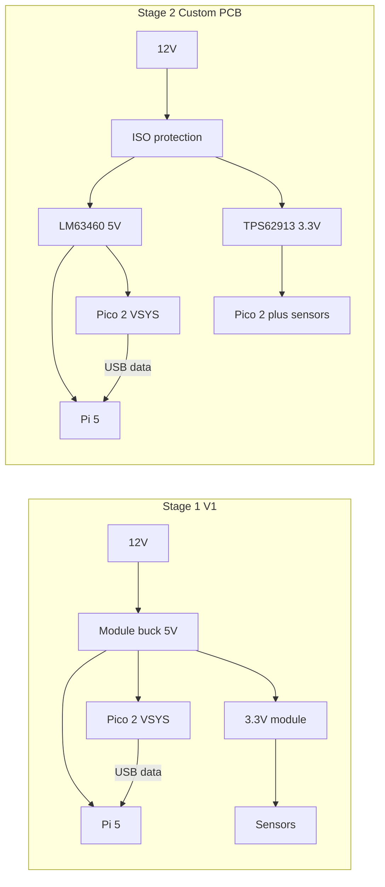
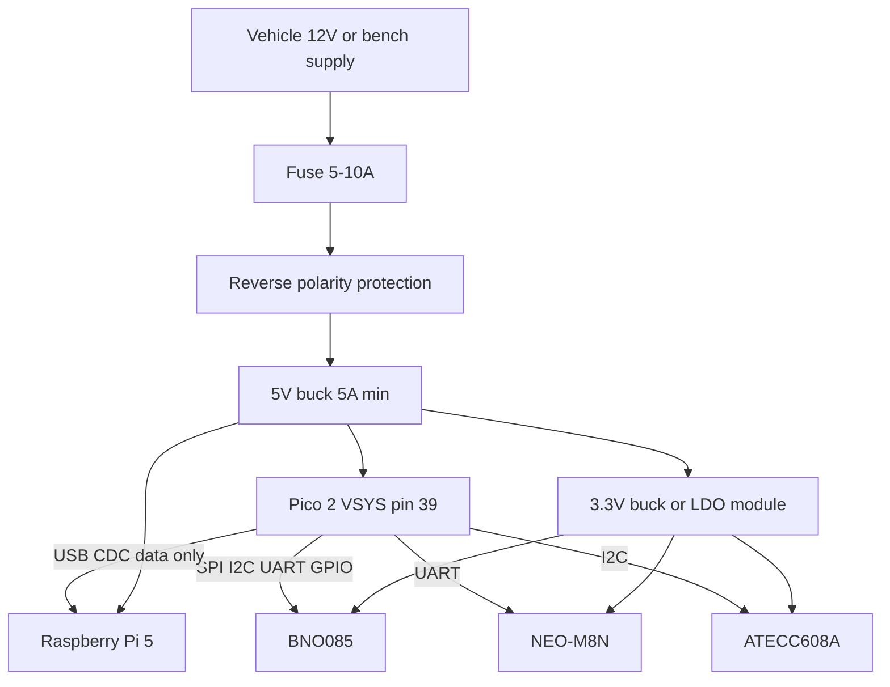
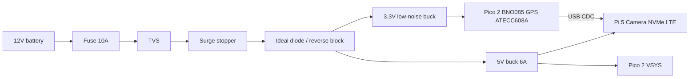

# Power Distribution

Detailed power architecture for the Vigia edge device: Stage 1 proof-of-concept (V1) and Stage 2 custom PCB (vehicle-grade).

**Related:** [Hardware Architecture](hardware-architecture.md) — system topology, compute split, and phased rollout.

**Principle (all stages):** The Raspberry Pi is a **load**, not the system power supply. Sensor rails must not be derived from Pi GPIO 3.3 V or Pico 2 `3V3(OUT)` when running the full sensor stack.

---

## Staged Approach

| Stage | Goal | Form factor | Vehicle install |
|---|---|---|---|
| **Stage 1 (V1)** | Proof of concept — validate sensors, USB CDC link, vision fusion | Dev boards + module bucks | Best-effort; known limitations |
| **Stage 2** | Pilot / fleet — reliability, protection, cost-down | Custom power distribution PCB | Designed for 12 V automotive |

Stage 1 intentionally trades automotive qualification for speed and BOM simplicity. Stage 2 implements the full dual-rail design described in [Hardware Architecture — Power Architecture](hardware-architecture.md#power-architecture).



---

## Power Budget

### 5 V rail (compute domain)

| Load | Typical | Peak | Notes |
|---|---|---|---|
| Raspberry Pi 5 (SoC + RP1) | 2–4 W | ~8–12 W | Inference + camera bursts |
| Pi Camera Module 3 | ~0.2 W | ~0.5 W | CSI |
| NVMe HAT + SSD | ~1–3 W | ~5 W | Write bursts |
| Active cooler | ~0.5–1 W | ~1 W | Under sustained load |
| Raspberry Pi Pico 2 (VSYS) | ~0.1–0.2 W | ~0.3 W | Sensor hub + USB PHY |
| Optional LTE modem | 1–3 W | ~5 W | Future |
| **Total** | **~5–10 W** | **~15–25 W** | **Design for 5 A minimum, 6 A recommended** |

### 3.3 V rail (sensor domain)

| Load | Typical | Peak | Notes |
|---|---|---|---|
| Raspberry Pi Pico 2 (logic) | 25–40 mA | ~60 mA | 100 Hz IMU loop @ 150 MHz |
| BNO085 | ~10 mA | ~15 mA | SPI @ 3 MHz |
| NEO-M8N | ~25 mA | ~45 mA | Acquisition / cold start |
| ATECC608A | ~3 mA | ~5 mA | I2C |
| **Total** | **~65 mA** | **~125 mA** | Stage 2: low-noise dedicated rail |

> **Note:** In Stage 1, Pico 2 MCU logic may be fed from VSYS (onboard SMPS) while sensor breakouts share a **separate** 3.3 V module. In Stage 2, the entire sensor domain — Pico 2 and peripherals — runs from one qualified 3.3 V rail.

### Automotive input (12 V nominal)

| Condition | Voltage | Stage 1 | Stage 2 |
|---|---|---|---|
| Nominal | 12–14 V | OK | OK |
| Engine running | up to ~14.5 V | OK | OK |
| Cranking | ~6–9 V | May brown out — document as known limit | Wide-input / buck-boost design |
| Load dump (suppressed) | up to ~35 V | Not protected — **do not rely on for fleet** | TVS + surge stopper |
| Reverse battery | −12 V | **Must fuse / protect in V1** | LM74930 + ideal diode |

---

## Stage 1 (V1) — Proof of Concept

### Topology

Single 12 V → 5 V conversion feeds the Pi and Pico 2 VSYS. Sensors run from a **separate 3.3 V regulator** on the same 5 V bus — not from Pico 2 `3V3(OUT)`.



### Why not power sensors from Pico 2 `3V3(OUT)`?

Pico 2 onboard regulation is sized for the RP2350 and light GPIO loads, not a full sensor stack. The `3V3(OUT)` pin is rated for **~300 mA** maximum. Under GPS acquisition + 100 Hz IMU + warm enclosure, sharing this rail with breakouts risks sag, brownout, and GPS HDOP degradation.

**Stage 1 rule:** Pico 2 VSYS (5 V domain) powers the MCU. BNO085, NEO-M8N, and ATECC608A get their own 3.3 V module. All boards share a common ground star point at the regulator.

### USB wiring (critical)

The Pico 2 connects to the Pi via **USB CDC** (`/dev/ttyACM0`). If Pico 2 is powered from **VSYS (5 V)** **and** connected via USB, **VBUS can backfeed** the Pi or fight the buck converter.

| Setup | Requirement |
|---|---|
| Pico 2 powered from **VSYS (5 V)** | **Data-only USB** — cut the 5 V wire in the cable or use a USB power blocker |
| Pico 2 powered **only from Pi USB** | Acceptable for bench; Pi supplies ~500 mA; loses independent sensor power domain |

For V1 vehicle demos, use **VSYS 5 V + data-only USB**.

### Minimum input protection (Stage 1)

Even for PoC, do not wire raw 12 V directly to a buck module.

| Element | Recommendation | Purpose |
|---|---|---|
| Fuse | 5–10 A automotive blade, close to battery tap | Overcurrent |
| Reverse polarity | Schottky series diode, P-FET module, or protected harness | Wrong clamp = dead electronics |
| TVS (recommended) | SMAJ24A or SMBJ26A across 12 V after fuse | Fast transients during car tests |
| Ground | Star ground at buck output | Reduce ground bounce |

### Recommended parts (Stage 1)

Industrial-quality modules from known vendors — not unbranded “car USB converter” boards.

#### 5 V rail

| Part | Output | Input | Notes |
|---|---|---|---|
| [Pololu D24V50F5](https://www.pololu.com/product/2858) | 5 V / **5 A** | 6–38 V | Primary V1 recommendation |
| [Pololu D24V90F5](https://www.pololu.com/product/2860) | 5 V / **9 A** | Extra margin for NVMe + cooler | |
| Official Pi 27 W USB-C PSU | 5 V / 5 A | Bench only | Vision pipeline bring-up without vehicle input |

#### 3.3 V sensor rail

| Part | Output | Input | Notes |
|---|---|---|---|
| [Pololu D24V3F3](https://www.pololu.com/product/2823) | 3.3 V / 3 A | 4.5–42 V | Feed from 5 V bus or 12 V |
| AMS1117-3.3 module | 3.3 V / ~500 mA | 5 V | Acceptable for sensors only; watch heat |

#### Bench shortcut

- Pi: USB-C PD or official 27 W supply.
- Pico 2 + sensors: VSYS from bench 5 V supply + separate 3.3 V module for breakouts.
- No vehicle transients — use for firmware and vision development only.

### Raspberry Pi 5 configuration

When powering from a fixed 5 V supply (not USB-PD), add to `config.txt`:

```ini
usb_max_current_enable=1
```

Without this, Pi 5 limits USB host current to **600 mA**, which can cause NVMe HAT or peripheral failures. See [Raspberry Pi USB PD whitepaper](https://pip-assets.raspberrypi.com/categories/685-app-notes-guides-whitepapers/documents/RP-009856-WP-1-USB%20Power%20delivery%20on%20Raspberry%20Pi%205.pdf).

### Wiring notes

| Connection | Guidance |
|---|---|
| Pi 5 V | GPIO pins 2+4 (+5 V) and 6+9+14+20+25+30+34+39 (GND) — **two wires each** for +5 V and GND, short and ≥18 AWG equivalent |
| Pi USB-C | Alternative 5 V entry if supply is clean; use 5 A rated cable |
| Pico 2 VSYS | Pin 39 (`VSYS`) + pin 38 (`GND`) — short leads from 5 V buck |
| Pico 2 firmware | BOOTSEL (pin 30) + USB for UF2 flash; no special programmer required |
| Sensors | Short SPI/I2C/UART to Pico 2; decouple each breakout (100 nF at module) |
| GPS antenna | Keep antenna cable away from buck converter and Pi switching noise |

### Stage 1 BOM (power only)

| Item | Qty | Est. cost | Notes |
|---|---|---|---|
| D24V50F5 (or equivalent) | 1 | $15–20 | 5 V / 5 A |
| D24V3F3 or 3.3 V module | 1 | $8–12 | Sensor rail |
| Fuse + holder | 1 | $2–5 | Inline on 12 V |
| Reverse polarity module | 1 | $3–8 | P-FET or protected input |
| TVS diode | 1 | $0.50 | Optional but recommended |
| USB power blocker or modified cable | 1 | $5–10 | Data-only to Pi |
| **Total** | | **~$35–55** | Excludes Pi / Pico 2 / sensors |

### Stage 1 known limitations

Document these when demoing in a vehicle:

| Limitation | Impact | Mitigation in Stage 2 |
|---|---|---|
| No ISO 16750 load-dump front-end | Reboot or damage on battery disconnect | Surge stopper + qualified bucks |
| Cranking voltage dips | Pi or buck may brown out | Wide VIN / buck-boost |
| Shared 5 V ripple | Possible GPS HDOP / IMU noise under heavy inference | Dedicated low-noise 3.3 V rail |
| Module bucks not AEC-Q100 | Temperature and lifetime not guaranteed | Custom PCB with `-Q1` parts |
| No ignition-linked safe shutdown | Risk of SD/NVMe corruption on power cut | PMIC + supercap or software shutdown |

These are **acceptable for V1 validation**; they are **not acceptable for fleet deployment**.

### Stage 1 bring-up checklist

- [ ] 12 V input fused and reverse-polarity protected
- [ ] 5 V buck verified at **≥4.75 V** under load (Pi running inference + camera)
- [ ] 3.3 V sensor rail verified at **3.25–3.35 V** with all sensors connected
- [ ] USB between Pi and Pico 2 is **data-only** (no VBUS conflict)
- [ ] `usb_max_current_enable=1` set on Pi
- [ ] Pico 2 visible as `/dev/ttyACM0`; heartbeat GPIO tested
- [ ] BNO085 @ 100 Hz and GPS @ 5 Hz stable for 30+ minutes under Pi load
- [ ] Document any brownout or sensor reset events during engine start

---

## Stage 2 — Custom Power Distribution PCB

### Topology

Protected 12 V input feeds **two independent regulated rails**: 5 V (compute) and 3.3 V (sensors). Matches the production intent in [Hardware Architecture](hardware-architecture.md).



**Power rule:** Pi and sensor hub share ground but **not** a regulator. The Pico 2 sensor domain runs entirely from the 3.3 V rail in Stage 2 (VSYS fed from 3.3 V via board-level OR-ing or dedicated Pico power input per PCB design).

### Input protection block

Designed for **ISO 16750-2** and **ISO 7637-2** at a level appropriate for an aftermarket edge device (confirm target OEM requirements before fleet).

| Function | Part (recommended) | Notes |
|---|---|---|
| Input fuse | 10 A automotive | First element on battery feed |
| Reverse battery + ideal diode | [TI LM74930-Q1](https://www.ti.com/product/LM74930-Q1) | AEC-Q100; see [TI load-dump app note](https://www.ti.com/lit/ab/snoaaa1/snoaaa1.pdf) |
| Active surge clamp | [ADI LTC4364](https://www.analog.com/en/products/ltc4364.html) | Programmable clamp ~22–27 V; handles load dump energy better than TVS alone |
| Fast transients | SMAJ24A / SMBJ26A TVS | ISO 7637 pulse mitigation |
| Bulk input cap | Low-ESR electrolytic + ceramic | Sized per reference design |

A single high-power TVS alone is often **insufficient** for unsuppressed load dump (ISO 16750 Test A). Use an active surge stopper or a TVS stack per reference design.

### 5 V rail — compute (Pi domain)

| Part | Spec | Why |
|---|---|---|
| **[TI LM63460-Q1](https://www.ti.com/product/LM63460-Q1)** (primary) | 6 A, 3–36 V in, 42 V transient, AEC-Q100 | Matches Pi 5 spec; good cranking tolerance |
| **[TI LM704A0-Q1](https://www.ti.com/product/LM704A0-Q1)** (alternative) | 10 A, 4.5–45 V in, fixed 5 V option | Headroom for LTE and thermal margin |

| Parameter | Target |
|---|---|
| Output voltage | 5.0 V ±1% |
| Output current | 6 A continuous capability |
| Switching frequency | 400 kHz–2.2 MHz; spread spectrum enabled |
| EMI | CISPR 25 pre-compliance on integrated PCB |

**Reference design:** [LM63460EVM-2MHZ](https://www.ti.com/tool/LM63460EVM-2MHZ) — 5 V / 6 A automotive EVM schematic as PCB starting point.

**Cranking:** If the product must stay alive below ~9 V during crank, add a buck-boost stage (e.g. [TPS55288-Q1](https://www.ti.com/product/TPS55288-Q1)) instead of a buck-only front-end.

### 3.3 V rail — sensor domain

| Part | Spec | Why |
|---|---|---|
| **[TI TPS62913-Q1](https://www.ti.com/product/TPS62913)** (primary) | 3 A, &lt;20 µV RMS noise, AEC-Q100 | Replaces buck+LDO for most sensor loads |
| **TPS62913 + [LP5912-Q1-3.3](https://www.ti.com/product/LP5912-Q1)** (optional) | Buck → LDO | Maximum GPS/IMU cleanliness if field tests show noise issues |

| Parameter | Target |
|---|---|
| Output voltage | 3.3 V ±1% |
| Output current | 500 mA design headroom (125 mA nominal load) |
| Ripple / noise | Minimize switching content in GPS L1 band |

**Reference design:** [TPS62913EVM-077](https://www.ti.com/tool/TPS62913EVM-077).

### Optional: 3.3 V topology comparison

| Approach | Efficiency | Noise | BOM | Stage 2 use |
|---|---|---|---|---|
| 12 V → 3.3 V buck (TPS62913-Q1) | High | Very low | Medium | **Default** |
| 12 V → 5 V → 3.3 V LDO | Lower | Lowest | Higher | If GPS HDOP sensitive |
| 5 V → 3.3 V LDO from Pi rail | — | — | — | **Never** |
| Pico 2 `3V3(OUT)` → sensors | — | — | — | **Never for vehicle install** |

### PCB layout rules (Stage 2)

| Rule | Rationale |
|---|---|
| Star ground at protection IC | ISO transient return paths |
| Keep sensor 3.3 V away from Pi/NVMe switching currents | IMU / GPS noise |
| Short, wide pours on 5 V and GND to Pi connector | Voltage drop under 6 A peaks |
| Shielded ground for GPS antenna feed | EMI |
| Place input protection close to power entry connector | Minimize unprotected trace length |
| Enable spread spectrum on bucks where available | CISPR 25 |
| Separate analog / digital ground tie at single point | Sensor bus integrity |
| Route Pico 2 USB D+/D− as differential pair | USB CDC reliability |

### Stage 2 BOM estimate (power PCB only)

| Item | Est. cost @ prototype qty |
|---|---|
| LM63460-Q1 + passives | $3–5 |
| TPS62913-Q1 + passives | $2–4 |
| LM74930-Q1 + MOSFETs | $4–6 |
| LTC4364 + passives | $5–8 |
| PCB, fuse, TVS, connectors | $10–15 |
| **Total** | **~$25–40** |

At 1,000+ volume with integrated vision PCB, fleet target remains ~$80–120/unit all-in per [Hardware Architecture — Prototype BOM](hardware-architecture.md#prototype-bom).

### Stage 2 validation

| Test | Standard / method |
|---|---|
| Cranking profile | ISO 16750-2 §4.6.3 (document pass/fail thresholds) |
| Load dump | ISO 16750-2 §4.6.4 Test B minimum (clamped alternator) |
| Reverse battery | ISO 16750-2 §4.7 |
| Conducted emissions | CISPR 25 Class 5 (pre-compliance) |
| Functional | BNO085 @ 100 Hz + GPS fix stable during full YOLO+MiDaS load |
| Thermal | 85 °C ambient soak, 6 A 5 V load, no thermal shutdown |

---

## Migration: Stage 1 → Stage 2

| Aspect | Stage 1 | Stage 2 | Migration action |
|---|---|---|---|
| 5 V generation | Pololu module | LM63460-Q1 on PCB | Reuse wiring harness; swap PCB mount |
| 3.3 V sensors | Separate module | TPS62913-Q1 on PCB | Same sensor harness pinout |
| Sensor hub | Pico 2 dev board | Custom RP2350 PCB (Phase 3) | Firmware portable; pin map documented |
| USB to Pi | Data-only cable | Data-only or onboard USB pinout | Keep data-only rule |
| Protection | Fuse + reverse + TVS | Full ISO front-end | New PCB absorbs protection |
| Firmware / protocol | Unchanged | Unchanged | No software power dependency |

**Connector strategy:** Define a single harness connector pinout in Stage 1 (12 V in, 5 V Pi out, 3.3 V sensor out, GND) so the Stage 2 PCB drops in without rewiring the vehicle.

---

## Quick Reference

### Stage selection

| Question | Stage 1 | Stage 2 |
|---|---|---|
| Validating algorithms and demo? | **Yes** | Overkill |
| Installing in customer vehicles long-term? | **No** | **Yes** |
| Need AEC-Q100 / ISO evidence? | No | **Yes** |
| Budget for custom PCB? | Minimal | Funded |

### Rail assignment (both stages)

| Rail | Powers | Must not power |
|---|---|---|
| 5 V | Pi 5, camera, NVMe, cooler, LTE, Pico 2 VSYS (Stage 1) | Sensors directly |
| 3.3 V | Pico 2 (Stage 2), BNO085, GPS, ATECC608A | Pi, camera, NVMe |

### Pi is a load, not a supply

Never use Pi GPIO 3.3 V (~500 mA shared budget) for the sensor hub. Never feed 12 V into the Pi. Never run the full sensor stack from Pico 2 `3V3(OUT)` in a vehicle install.

---

## Glossary

| Term | Definition |
|---|---|
| AEC-Q100 | Automotive IC qualification (−40 °C to +125 °C) |
| Buck | Step-down DC-DC converter |
| Load dump | High-energy overvoltage when battery disconnects while alternator is charging |
| LDO | Low-dropout linear regulator — low noise, lower efficiency |
| TVS | Transient voltage suppressor diode |
| USB CDC | USB serial — Pico 2 appears as `/dev/ttyACM0` |
| VBUS | USB +5 V power line — isolate when Pico 2 has separate VSYS feed |
| VSYS | Pico 2 system voltage input (1.8–5.5 V) |

---

## Revision History

| Date | Change |
|---|---|
| 2026-06-10 | Initial document — Stage 1 V1 and Stage 2 custom PCB |
| 2026-06-11 | Migrated sensor hub from STM32 Black Pill to Raspberry Pi Pico 2 |
