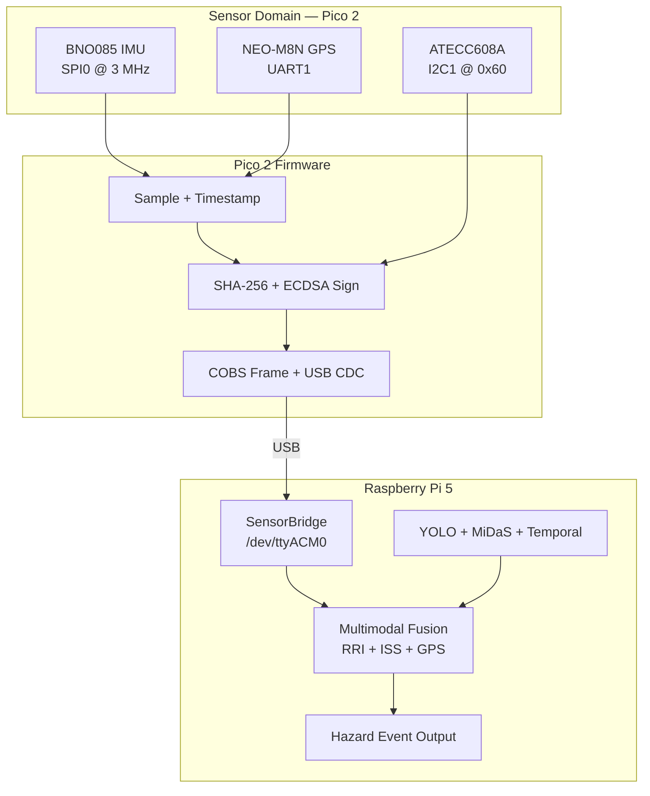

# Sensor Fusion Integration Plan — Iteration 1

**Status:** Active  
**Scope:** Raspberry Pi Pico 2 sensor hub → Pi 5 ingest → multimodal fusion with existing vision pipeline  
**Target:** Working prototype v1 — BNO085 IMU + NEO-M8N GPS + ATECC608A secure element, fused with YOLO/MiDaS RRI on Pi 5

**Related documents:**
- [Hardware Architecture](hardware-architecture.md) — system topology, pin map, data flows
- [Pico ↔ Pi Bring-Up](pico-pi-bringup.md) — USB CDC link verification
- [Power Distribution](power-distribution.md) — Stage 1 wiring and rails
- [firmware/README.md](../firmware/README.md) — build and flash instructions
- `.claude/design/03_pico2_firmware_contracts.md` — long-term binary protocol and driver contracts (reference)

---

## 1. Purpose

This document is the execution plan for integrating physical sensors into VIGIA and connecting them to the existing vision pipeline. It assumes:

- **One repo** for iteration 1 (firmware + Pi code + tools + docs).
- **Incremental delivery** — each milestone produces a testable artifact before moving on.
- **Text protocol first, binary second** — mirror the GPS bring-up pattern (`VIGIA_GPS` lines) before migrating to framed binary packets and ECDSA signing.

The end product for iteration 1 is a bench- and field-testable edge node where:

1. Pico 2 samples IMU @ ~100 Hz and GPS @ ~5–10 Hz with monotonic timestamps.
2. Pico 2 signs kinematic context with ATECC608A and sends authenticated packets to the Pi.
3. Pi ingests, verifies, and time-aligns sensor data with camera frames.
4. Fusion engine combines vision RRI with motion (ISS) and GPS geo-tagging to produce hazard events.

---

## 2. Current Baseline (Complete)

| Item | State | Evidence |
|------|-------|----------|
| Pi ↔ Pico USB CDC link | **Done** | `/dev/ttyACM0` enumerates; `VIGIA_PING` @ 1 Hz |
| NEO-M8N GPS driver (Pico) | **Done** | `firmware/src/neo_m8n_driver.c` — UBX NAV-PVT parser |
| GPS over USB to Pi | **Done** | `VIGIA_GPS` text lines; `tools/pico_gps_monitor.py` |
| Vision pipeline (Pi) | **Done** | YOLO + MiDaS + RRI fusion in `src/` (vision-only inputs) |
| BNO085 IMU | **Not started** | Pin map defined; no driver |
| ATECC608A secure element | **Not started** | Pin map defined; no driver |
| Binary wire protocol | **Not started** | Text lines only |
| Pi sensor ingest (C++) | **Not started** | Python monitors only |
| Multimodal fusion | **Not started** | `FusionEngine` has no IMU/GPS inputs |

### Current wire format (interim — text)

```
VIGIA_GPS seq=0 lat=37.1234567 lon=-122.1234567 speed_ms=0.00 fix_type=3 satellites=12 hdop=0.85 valid=1 src=ubx
VIGIA_PING seq=0 uptime_ms=2500 boot_ms=1200 fw=gps uart_rx=... baud=9600
```

### Current firmware layout

```
firmware/
├── CMakeLists.txt          # target: vigia_pico_hello (C, stdio USB CDC)
└── src/
    ├── main.c
    ├── neo_m8n_driver.c/.h
    └── vigia_pins.h        # GPS UART pins only
```

---

## 3. Target End State (Iteration 1)



### Iteration 1 acceptance criteria (system-level)

| # | Criterion | Target |
|---|-----------|--------|
| 1 | IMU effective rate on Pi | ≥ 95 Hz sustained over 10 min |
| 2 | GPS effective rate on Pi | ≥ 5 Hz with valid fix outdoors |
| 3 | Packet loss (seq gaps) | ≤ 0.1% over 10 min |
| 4 | ECDSA verify on Pi | 0 failures over 1000 consecutive signed packets |
| 5 | Gravity-compensated ISS on flat road | ≈ 0 at constant speed (no false potholes on hills) |
| 6 | Vision + sensor fusion | Hazard events include lat/lon when GPS valid |
| 7 | End-to-end latency (sensor sample → fusion input) | ≤ 50 ms p95 |
| 8 | Bench run without crash | 30 min continuous |

---

## 4. Development Principles

1. **One sensor at a time.** Do not wire IMU + ATECC + new protocol in a single step.
2. **Prove on the bench before vehicle.** Each milestone has a pass/fail test on the desk.
3. **Keep GPS working.** Every firmware increment must not regress the existing GPS path.
4. **Shared contract early.** Define `protocol/vigia_packet.h` before binary migration; Pi and Pico must agree on struct layout.
5. **Pico samples; Pi fuses.** IMU quaternion math for ISS and Kalman velocity estimation run on the Pi (Linux has FPU headroom). Pico does deterministic sampling, timestamping, and signing.
6. **No `pico-sdk` in git.** Use `PICO_SDK_PATH` pointing to a local clone or submodule.

---

## 5. Milestones

### Milestone 0 — Baseline ✓

**Goal:** Pi ↔ Pico link + GPS coordinates on the Pi.

**Status:** Complete.

**Verification:**
```bash
python3 tools/pico_gps_monitor.py --duration 30
# Expect: VIGIA_GPS lines, valid=1 outdoors, ~1 Hz (current firmware rate)
```

---

### Milestone 1 — BNO085 Hardware Bring-Up (Pico only)

**Goal:** Read rotation vector and linear acceleration from BNO085 over SPI; no USB output changes yet.

**Wiring (Pico 2 header):**

| BNO085 pin | Pico 2 GPIO | Bus |
|------------|-------------|-----|
| SCK | GP18 | SPI0 |
| MOSI | GP19 | SPI0 |
| MISO | GP16 | SPI0 |
| CS | GP17 | GPIO (active LOW) |
| INT | GP20 | GPIO IRQ (falling edge) |
| RST | GP21 | GPIO (active LOW reset) |
| VCC | 3V3 (OUT) | Shared sensor rail |
| GND | GND | Common |

> Use a **dedicated 3.3 V sensor rail** for BNO085 + GPS + ATECC when all three are populated. Do not power the full sensor stack from Pico `3V3(OUT)` alone — see [Power Distribution](power-distribution.md).

**Firmware tasks:**

| Task | File(s) | Notes |
|------|---------|-------|
| Extend pin map | `firmware/src/vigia_pins.h` | SPI0 + BNO085 CS/INT/RST |
| BNO085 SHTP driver | `firmware/src/bno085_driver.c/.h` | SPI @ 3 MHz max; no malloc |
| Boot + feature enable | driver init | Rotation Vector (0x05) + Linear Accel (0x04) @ 10 ms |
| IRQ + poll loop | `main.c` | INT falling edge → SPI read → parse |
| Debug output (optional) | SWO or USB | Print raw quaternion/accel over USB for bench debug only |

**BNO085 configuration (required):**

- **NDOF fusion mode** — outputs Earth-referenced quaternion (not raw IMU-only mode).
- Report interval: **10 ms** (100 Hz).
- Outputs needed: `Rotation Vector` (quaternion w,x,y,z) + `Linear Acceleration` (x,y,z).

**Acceptance criteria:**

| Test | Pass |
|------|------|
| Device responds after reset | INT fires within 1 s of boot |
| Quaternion magnitude | ‖q‖ ≈ 1.0 ± 0.02 when stationary |
| Sample rate | ≥ 95 valid reports/s (logic analyzer on CS or firmware counter) |
| Orientation response | Rotate board 90° → quaternion changes predictably |
| GPS still works | `neo_m8n_poll()` unaffected; GPS lines still print |

**Estimated effort:** 3–5 days (SHTP protocol is the main complexity).

---

### Milestone 2 — IMU on the Wire (Text Protocol)

**Goal:** Emit `VIGIA_IMU` lines over USB CDC alongside `VIGIA_GPS`, same pattern as GPS bring-up.

**Interim wire format:**

```
VIGIA_IMU seq=42 qw=0.998 qx=0.012 qy=-0.003 qz=0.055 ax=0.01 ay=-0.02 az=0.15 cal=3 valid=1
```

| Field | Type | Description |
|-------|------|-------------|
| `seq` | uint32 | Monotonic sequence |
| `qw..qz` | float | Unit quaternion (Earth frame) |
| `ax..az` | float | Linear acceleration (m/s², body frame) |
| `cal` | uint8 | BNO085 calibration status (0–3 per sensor) |
| `valid` | 0/1 | Parser succeeded |

**Firmware tasks:**

| Task | Notes |
|------|-------|
| Merge IMU + GPS print loop | IMU @ 100 Hz (or decimate to 10 Hz for USB if bandwidth is tight during dev) |
| Timestamp each sample | `get_absolute_time()` → microseconds since boot |
| Pi monitor tool | `tools/pico_imu_monitor.py` — parse, print rate, detect seq gaps |

**Acceptance criteria:**

| Test | Pass |
|------|------|
| `pico_imu_monitor.py --duration 60` | ≥ 950 IMU messages in 10 s window (if running at 100 Hz) |
| Seq gaps | 0 gaps over 60 s |
| Quaternion norm | Mean ‖q‖ in [0.98, 1.02] |
| GPS regression | `pico_gps_monitor.py` still passes |

**Estimated effort:** 1–2 days.

---

### Milestone 3 — ATECC608A Bring-Up (Pico only)

**Goal:** Prove I2C communication, read device serial, perform SHA-256 + ECDSA sign on a test payload.

**Wiring:**

| ATECC608A pin | Pico 2 GPIO | Notes |
|---------------|-------------|-------|
| SDA | GP6 | I2C1, 4.7 kΩ pull-ups to 3.3 V |
| SCL | GP7 | I2C1 |
| VCC | 3.3 V sensor rail | |
| GND | GND | |

**Firmware tasks:**

| Task | File(s) | Notes |
|------|---------|-------|
| Extend pin map | `vigia_pins.h` | I2C1 pins |
| Integrate cryptoauthlib | `firmware/third_party/cryptoauthlib/` | `ATCA_NO_HEAP`; RP2350 I2C HAL |
| Device probe | `atecc608a_driver.c/.h` | `atcab_read_serial_number()`, `atcab_info()` |
| Key provisioning | one-time script or manual | Generate key pair in slot 0; **document slot layout** |
| Sign test vector | driver | SHA-256 + `atcab_sign()` on 96-byte `EtHashInput` |

**Provisioning note:** The ATECC608A must be provisioned once with a device identity and signing key. Record:
- Device serial number (hex)
- Public key (hex) — needed on Pi for signature verification
- Key slot used

Store public keys in `config/device_keys/` (gitignored) or a fleet registry document.

**Acceptance criteria:**

| Test | Pass |
|------|------|
| I2C probe | `atcab_info()` returns `ATCA_SUCCESS` |
| Serial read | Matches label on breakout |
| Sign latency | ≤ 75 ms per signature |
| IMU + GPS unaffected | Previous milestones still pass |
| 100 consecutive signs | 0 failures |

**Estimated effort:** 2–4 days (cryptoauthlib integration + provisioning).

---

### Milestone 4 — Binary Protocol Migration

**Goal:** Replace text lines with framed binary packets: COBS-encoded, versioned, sequenced, with ECDSA signatures.

**New shared contract:**

```
protocol/
└── vigia_packet.h      # C header — copied/linked by firmware and Pi
```

**Target packet types (v1):**

| Type ID | Name | Rate | Payload |
|---------|------|------|---------|
| `0x01` | `IMU_SAMPLE` | 100 Hz | quaternion (4×f32) + linear accel (3×f32) + cal status (u8) |
| `0x02` | `GPS_FIX` | 5–10 Hz | lat/lon (2×f64) + alt/speed/course (3×f32) + fix/sats/hdop |
| `0x03` | `SIGNED_ET` | 10 Hz | Combined IMU+GPS kinematic context + SHA-256 hash + ECDSA-64 sig |
| `0x04` | `MCU_HEALTH` | 1 Hz | uptime, packet counters, sensor status, auth failures |
| `0x05` | `FAULT_EVENT` | On event | brownout, sensor reset, watchdog |

**Wire envelope (per packet):**

```
[COBS framing]
  version:1
  type:1
  seq:4       (little-endian)
  timestamp_us:8
  payload:N
  [ecdsa_sig:64]   (SIGNED_ET and optionally others in v1)
[COBS end]
```

Full struct layouts match `.claude/design/03_pico2_firmware_contracts.md` §6.3–6.4. The `EtHashInput` struct (96 bytes) is the ABI between Pico, Pi, and future cloud attestation.

**Firmware tasks:**

| Task | File(s) |
|------|---------|
| COBS encoder | `firmware/src/cobs.c/.h` |
| Packet builder | `firmware/src/vigia_tx.c/.h` |
| Microsecond timer | `firmware/src/tim_us.c/.h` | 64-bit monotonic µs counter |
| Main loop refactor | `main.c` | Super-loop: IMU IRQ → GPS parse → sign on GPS tick → transmit |
| Retire text output | behind `#ifdef VIGIA_DEBUG_TEXT` | Keep for debug builds only |

**Pi tasks:**

| Task | File(s) |
|------|---------|
| COBS decoder | `src/cobs.cpp` or shared C |
| Packet parser | `src/sensor_packet.cpp/.hpp` |
| Python verifier | `tools/pico_packet_monitor.py` | Decode + print stats |

**Acceptance criteria:**

| Test | Pass |
|------|------|
| COBS round-trip | Encode/decode test vector — bit-exact |
| IMU packet rate | ≥ 95 Hz decoded on Pi |
| GPS packet rate | ≥ 5 Hz decoded on Pi |
| SIGNED_ET verify | mbedTLS or openssl ECDSA verify — 1000/1000 pass |
| Replay attack | Re-sent packet rejected (seq + optional window) |
| Text protocol regression | Debug build still prints `VIGIA_GPS` if needed |

**Estimated effort:** 4–6 days.

---

### Milestone 5 — Pi Sensor Bridge (C++)

**Goal:** Production ingest path — background thread reading `/dev/ttyACM0`, decoding packets, exposing thread-safe sensor state to the coordinator.

**New Pi modules:**

```
include/
├── sensor_bridge.hpp       # Serial reader + decoder
├── sensor_state.hpp        # Latest IMU, GPS, health (mutex-protected)
└── sensor_packet.hpp       # Parsed packet types

src/
├── sensor_bridge.cpp
└── sensor_state.cpp
```

**`SensorBridge` responsibilities:**

1. Open `/dev/ttyACM0` at 921600 baud (or max stable CDC rate).
2. COBS-decode incoming bytes into `vigia_packet.h` structs.
3. Verify ECDSA signature on `SIGNED_ET` packets (public key from config).
4. Update `SensorState` — latest IMU sample, latest GPS fix, health counters.
5. Track sequence numbers; increment `auth_failures` on bad sig.
6. Expose `getLatestImu()`, `getLatestGps()`, `getSampleAtOrBefore(timestamp)` for camera alignment.

**Integration point:** `Coordinator` holds a `SensorBridge&` and polls sensor state each frame in `processLoop()`.

**Acceptance criteria:**

| Test | Pass |
|------|------|
| Unit test: packet parse | Golden vectors from firmware hex dumps |
| Unit test: ECDSA verify | Known sig from Milestone 3 |
| Integration: 10 min run | No crashes; seq gap rate ≤ 0.1% |
| Camera alignment | `getSampleAtOrBefore(frame_timestamp)` returns IMU within 10 ms |
| CPU overhead | Sensor bridge thread < 5% of one core |

**Estimated effort:** 3–5 days.

---

### Milestone 6 — Multimodal Sensor Fusion

**Goal:** Extend `FusionEngine` and `Coordinator` to consume IMU + GPS alongside vision outputs.

#### 6.1 Gravity compensation + ISS (Impact Severity Score)

The BNO085 outputs body-frame linear acceleration that still embeds gravity projection on inclines. **Do not use raw Z-axis accel for pothole detection.**

Correct pipeline (mandatory):

```
1. a_world = quaternion_rotate(q, a_body)     # body → Earth frame
2. a_detrended = a_world - [0, 0, 9.81]       # remove gravity
3. ISS = |a_detrended.z| / max(v_gps, 2.0)    # v_min = 2.0 m/s
4. ISS_normalized = clamp(ISS / ISS_max, 0, 1)  # ISS_max tunable (~3.0 initial)
```

Reference: `.claude/design/01_system_architecture_and_roadmap.md` §5 Improvement 2.

#### 6.2 Updated fusion scoring (iteration 1)

Extend `FusionInput` / `FusionEngine`:

```
RRI = 0.35 × yolo_conf
    + 0.25 × geometry_conf
    + 0.15 × temporal_conf
    + 0.25 × ISS_normalized
```

Weights live in `config/fusion_params.yaml` (or constexpr defaults initially).

#### 6.3 GPS geo-tagging

When `GPS_FIX.valid` and `fix_type >= 2`:

- Attach `latitude`, `longitude`, `speed_ms`, `hdop` to hazard events.
- Suppress geo-tag when `hdop > 2.5` or `fix_type < 2`.

#### 6.4 Motion gating (optional v1)

- If `speed_ms < 1.0` (parked / garage), raise hazard threshold or suppress ISS contribution.
- Prevents false positives when the vehicle is stationary.

**Files to modify:**

| File | Change |
|------|--------|
| `include/fusion.hpp` | Add `imuIss`, `gpsSpeed`, optional GPS fields to `FusionInput` |
| `src/fusion.cpp` | Implement ISS-aware scoring |
| `include/sensor_state.hpp` | IMU/GPS structs |
| `src/coordinator.cpp` | Pull sensor state per frame; pass to fusion |
| `include/coordinator.hpp` | `SensorBridge` member |
| `src/main.cpp` | Construct and start `SensorBridge` |

**Acceptance criteria:**

| Test | Pass |
|------|------|
| Flat road, 30 km/h | ISS ≈ 0 (±0.2) for 60 s |
| Speed bump at 20 km/h | ISS peak > 1.5 |
| Hill climb (no bump) | ISS stays low (gravity compensation working) |
| Hazard event | Includes lat/lon when GPS valid |
| Vision-only regression | `make test` still passes with sensor bridge disabled |

**Estimated effort:** 4–6 days.

---

### Milestone 7 — Prototype Hardening

**Goal:** Move from bench demo to a reliable iteration-1 prototype.

| Area | Tasks |
|------|-------|
| **Power** | Stage 1 wiring per [power-distribution.md](power-distribution.md); separate 3.3 V sensor rail; data-only USB to Pi |
| **Watchdog** | Pico GPIO heartbeat (GP26 → Pi); Pi GPIO alive (GP27 → Pico); MCU_HEALTH @ 1 Hz |
| **Logging** | NVMe or local CSV/JSON event log with timestamp, RRI, ISS, lat/lon, frame index |
| **Thermal** | Confirm vision pipeline still meets FPS target with sensor bridge running |
| **Enclosure** | Rigid BNO085 mount; GPS antenna sky view; camera forward mount |
| **Config** | `config/device.yaml` — serial port, baud, ATECC public key, fusion weights |
| **Docs** | Update `firmware/README.md` with full wiring diagram |
| **CI** | Firmware builds in GitHub Actions (arm-none-eabi); Pi tests run `make test` |

**Acceptance criteria:** System-level table in §3 — all 8 rows pass.

**Estimated effort:** 5–7 days.

---

## 6. Recommended Execution Order

```
M0 ✓ GPS link
 │
 ▼
M1 BNO085 driver (bench debug)
 │
 ▼
M2 VIGIA_IMU text lines + pico_imu_monitor.py
 │
 ├──────────────────┐
 ▼                  ▼
M3 ATECC608A      (GPS + IMU keep running)
 │
 ▼
M4 Binary protocol + COBS + signing
 │
 ▼
M5 Pi SensorBridge (C++)
 │
 ▼
M6 Multimodal fusion
 │
 ▼
M7 Prototype hardening
```

**Parallelism:** Milestone 3 (ATECC) can start in parallel with Milestone 2 once M1 passes, as long as I2C does not share pins with SPI0/UART1 (it does not).

---

## 7. Pin Map (Complete — Iteration 1)

| Signal | GPIO | Bus | Device |
|--------|------|-----|--------|
| SPI0_SCK | GP18 | SPI0 | BNO085 |
| SPI0_MOSI | GP19 | SPI0 | BNO085 |
| SPI0_MISO | GP16 | SPI0 | BNO085 |
| BNO085_CSN | GP17 | GPIO | BNO085 |
| BNO085_INT | GP20 | GPIO IRQ | BNO085 |
| BNO085_RST | GP21 | GPIO | BNO085 |
| UART1_TX | GP8 | UART1 | NEO-M8N (config) |
| UART1_RX | GP9 | UART1 | NEO-M8N |
| I2C1_SDA | GP6 | I2C1 | ATECC608A |
| I2C1_SCL | GP7 | I2C1 | ATECC608A |
| LED_STATUS | GP25 | GPIO | Onboard LED |
| HEARTBEAT_OUT | GP26 | GPIO | → Pi GPIO input |
| PI_ALIVE_IN | GP27 | GPIO | ← Pi GPIO output |
| USB D+/D− | — | USB | Pi 5 `/dev/ttyACM0` |

---

## 8. Target Repository Layout (End of Plan)

```
vigia-raspi/
├── protocol/
│   └── vigia_packet.h              # Shared wire contract
├── firmware/
│   ├── CMakeLists.txt
│   └── src/
│       ├── main.c
│       ├── vigia_pins.h
│       ├── bno085_driver.c/.h
│       ├── neo_m8n_driver.c/.h
│       ├── atecc608a_driver.c/.h
│       ├── cobs.c/.h
│       ├── vigia_tx.c/.h
│       └── tim_us.c/.h
├── include/
│   ├── fusion.hpp                  # Extended inputs
│   ├── sensor_bridge.hpp
│   ├── sensor_state.hpp
│   └── sensor_packet.hpp
├── src/
│   ├── sensor_bridge.cpp
│   ├── sensor_state.cpp
│   ├── fusion.cpp                  # ISS-aware scoring
│   └── coordinator.cpp             # Sensor + vision merge
├── tools/
│   ├── pico_gps_monitor.py
│   ├── pico_imu_monitor.py         # M2
│   └── pico_packet_monitor.py      # M4
├── config/
│   ├── fusion_params.yaml
│   └── device.yaml.example
└── docs/
    └── sensor-fusion-plan.md       # This document
```

---

## 9. Testing Matrix

| Milestone | Bench test | Tool / command | Pass metric |
|-----------|------------|----------------|-------------|
| M1 | IMU raw read | Serial debug / logic analyzer on CS | ≥ 95 Hz |
| M2 | IMU on wire | `pico_imu_monitor.py --duration 60` | ≥ 950 msgs / 10 s |
| M2 | GPS regression | `pico_gps_monitor.py --duration 30` | No regression |
| M3 | ATECC sign | Firmware self-test or `tools/atecc_test.py` | 100/100 signs |
| M4 | Binary decode | `pico_packet_monitor.py --duration 600` | ≤ 0.1% loss |
| M4 | Signature | Same tool `--verify` | 0 verify failures |
| M5 | Bridge soak | Run main app 30 min | No crash |
| M6 | ISS flat road | Drive / simulate at 30 km/h | ISS ≈ 0 |
| M6 | ISS bump | Speed bump at 20 km/h | ISS > 1.5 |
| M7 | Full system | Field test 30 min | §3 criteria all pass |

---

## 10. Risks and Mitigations

| Risk | Impact | Mitigation |
|------|--------|------------|
| BNO085 SHTP protocol complexity | Schedule slip on M1 | Start with SparkFun/Adafruit reference; scope to Rotation Vector + Linear Accel only |
| USB CDC bandwidth at 100 Hz IMU + 10 Hz signed packets | Packet loss | COBS binary (M4); raise baud to 921600; decimate IMU on wire if needed during M2 |
| ATECC608A provisioning mistakes | Bricked or wrong key | One breakout dedicated to dev; document slot map; never re-provision without backup |
| Gravity false positives without quaternion math | Bad hazard detection | Mandatory quaternion rotation in M6; unit test with synthetic incline data |
| Pi CPU load from sensor + vision | FPS drop | Sensor bridge on dedicated thread; profile before M7 sign-off |
| Shared 3.3 V rail noise | IMU/GPS glitches | Separate LDO for sensor domain per power-distribution doc |
| Text → binary migration breaks tools | Debug confusion | Keep `VIGIA_DEBUG_TEXT` build flag for one release cycle |

---

## 11. Out of Scope for Iteration 1

These are documented in the long-term roadmap but **not** part of this plan:

- ROS 2 middleware migration
- ONNX Runtime replacement of OpenVINO
- LTE uplink and cloud mTLS ingest
- PREEMPT_RT kernel
- Custom PCB (Stage 2 power board)
- OTA firmware updates
- Accident detection / pre-event video buffer

---

## 12. Next Action

**Start Milestone 1:** Wire BNO085 per §7, extend `vigia_pins.h`, implement `bno085_driver.c` with SHTP init + Rotation Vector @ 100 Hz.

Suggested first PR scope:
1. `vigia_pins.h` — SPI0 + BNO085 pins
2. `bno085_driver.c/.h` — init, IRQ, parse (no USB output change)
3. `firmware/README.md` — BNO085 wiring table
4. Bench verification notes in PR description

---

*Last updated: 2026-06-15*
